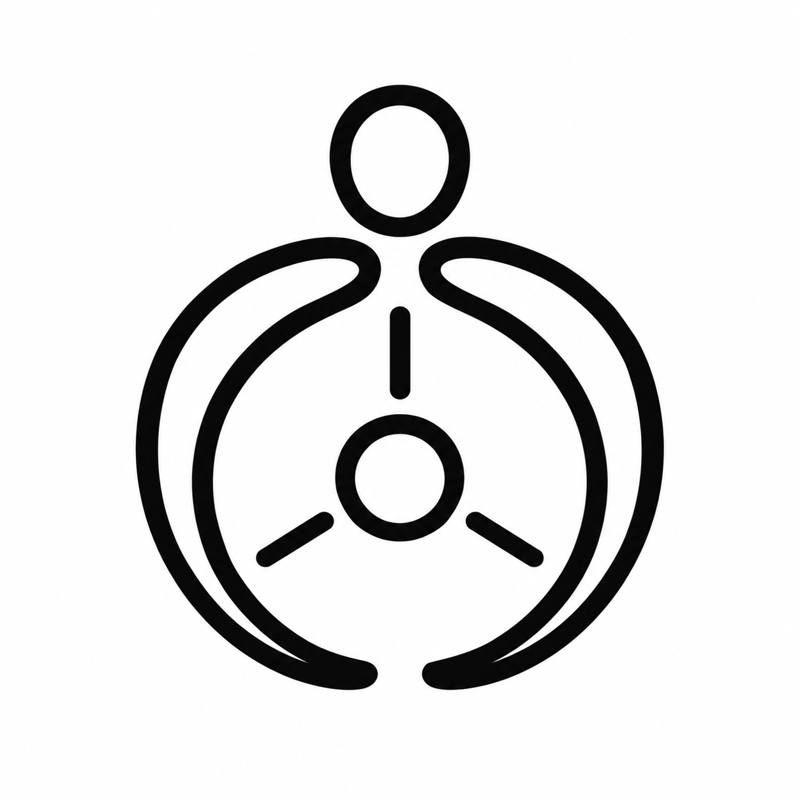
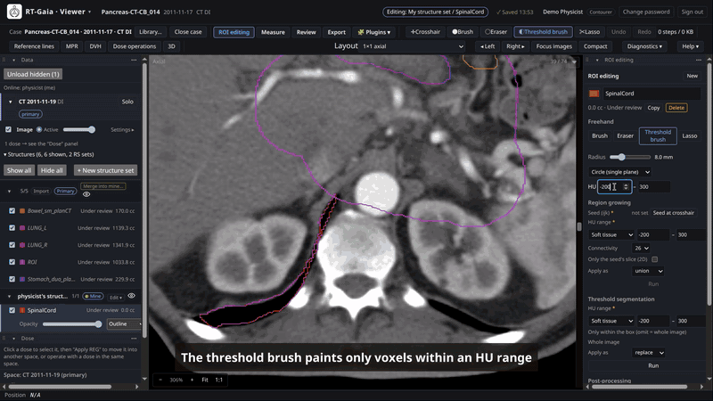
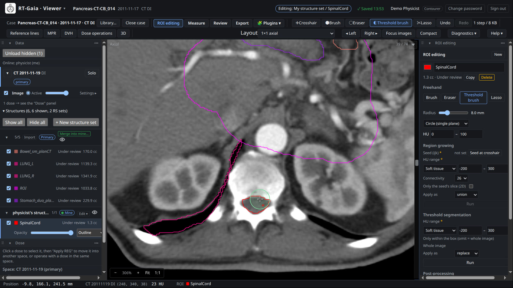
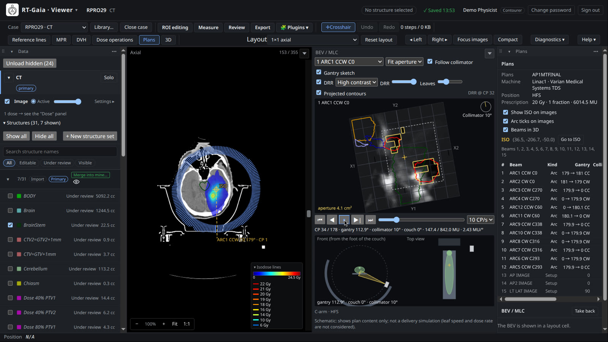
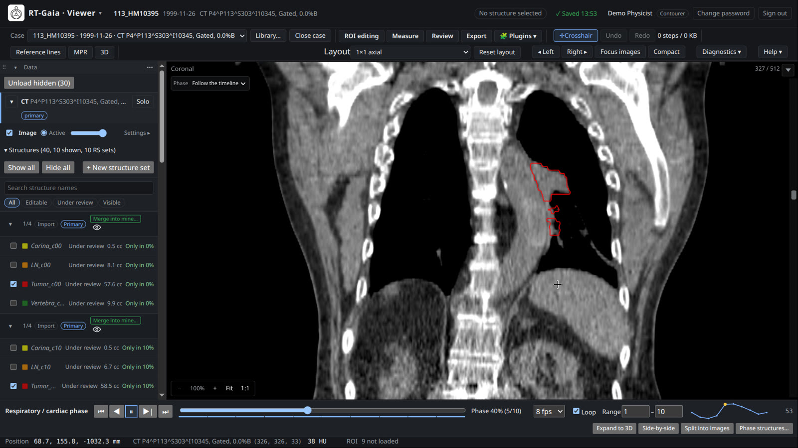
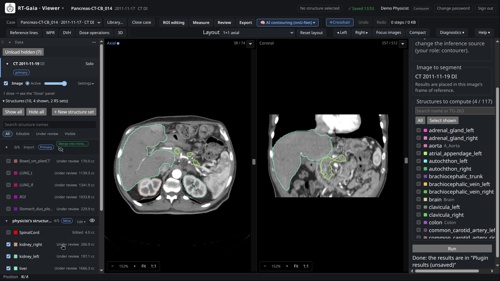

<p align="center">
  
</p>

<h1 align="center">RT-Gaia</h1>

<p align="center">
  Web-based radiotherapy imaging, contouring and review.<br/>
  Images, structures, dose, plans and measurements share <strong>one 3D + time space</strong>.
</p>

<p align="center">
  <a href="docs/user-guide.md">User guide</a> ·
  <a href="docs/administration.md">Administration</a> ·
  <a href="docs/architecture.md">Architecture</a> ·
  <a href="docs/plugins.md">Plugins</a> ·
  <a href="docs/README.md">All documentation</a> ·
  <a href="#中文簡介">中文簡介</a>
</p>

> **Research software.** RT-Gaia is not a medical device. It has not been cleared or approved by any
> regulatory authority and must not be used for clinical decision making. Use only de-identified data
> for testing and demonstrations. The project is in pre-release: interfaces and data formats may still
> change.

<p align="center">
  <a href="docs/assets/demo/rt-gaia-demo.mp4"></a><br/>
  <a href="docs/assets/demo/rt-gaia-demo.mp4"><strong>▶ Watch the 3-minute demo</strong></a> (MP4, English captions)
</p>

## What it does

RT-Gaia is a browser application with a Python backend for the DICOM objects of radiotherapy: planning
CT, CBCT, MR and PET images, structure sets (RTSTRUCT), doses (RTDOSE), plans (RTPLAN) and spatial
registrations (REG). It is built to sit next to auto-contouring and registration engines and give
clinicians and researchers one place to view, edit, compare, review and export the results.

Everything you open is placed in a single shared space. A CBCT registered to the planning CT is drawn in
the CT's coordinates together with its own structures and dose; the crosshair, readouts and
measurements refer to the same physical point in every view; a 4D series adds time to the same space.

### Highlights

- **Library** — import from the browser (files, folders, zip), from a server directory or from DICOM
  nodes; a patient / study / series tree with RT objects attached to their images; 4D groups detected
  from real DICOM; trash with restore.
- **Viewing** — linked axial, coronal and sagittal views, oblique MPR with slabs, several series in one
  space through registrations, overlay / checkerboard / difference fusion, a configurable layout, PET
  SUV readout.
- **Contouring** — brush, eraser, threshold brush, lasso, region growing, threshold segmentation and
  post-processing; each user edits a personal working set and merges explicitly; one stroke is one undo
  step.
- **Dose** — colorwash and isodose lines, DVH with D98 / D95 / D50 / D2 and V(ref), dose arithmetic
  (add, subtract, scale, sum beam doses), results saved as RTDOSE.
- **Plans** — beam table, isocenter markers, beam's-eye view with jaws and MLC, control-point timeline,
  DRR and a gantry sketch (display only; RT-Gaia does not calculate dose).
- **3D and 4D** — server-rendered volume rendering with structures and dose; 4D playback, time-intensity
  curves, temporal structures and ITV.
- **Review and export** — sign-off by role, RTSTRUCT export to a file, to the library or to a DICOM node,
  an export log, an append-only audit trail.
- **Plugins** — out-of-process services in any language behind a versioned HTTP contract, with a Python
  SDK and an nnU-Net auto-contouring example.
- **Anywhere** — English and Traditional Chinese interface; a phone and tablet layout with touch and
  stylus input; no GPU needed on the client.

See the [user guide](docs/user-guide.md) for the full feature tour and the [changelog](CHANGELOG.md)
for what is in the current version.

## Demo

The [demo video](docs/assets/demo/rt-gaia-demo.mp4) (3 minutes, MP4, English captions) walks through the
library, the viewer, contouring, dose and DVH, PET/CT, 4D, plan review, 3D, AI auto-contouring through a
plugin, review and export, and the phone layout.

| | |
|---|---|
|  |  |
|  |  |

### Demo data

The screenshots and videos use public data under Creative Commons Attribution licenses, from The Cancer
Imaging Archive (Clark K et al., J Digit Imaging 2013;26(6):1045–1057) through the NCI Imaging Data
Commons, and from Zenodo:

- Pancreatic-CT-CBCT-SEG (CC BY 4.0, [doi:10.7937/TCIA.ESHQ-4D90](https://doi.org/10.7937/TCIA.ESHQ-4D90))
- CC-Tumor-Heterogeneity (CC BY 4.0, [doi:10.7937/ERZ5-QZ59](https://doi.org/10.7937/ERZ5-QZ59))
- 4D-Lung (CC BY 3.0, [doi:10.7937/K9/TCIA.2016.ELN8YGLE](https://doi.org/10.7937/K9/TCIA.2016.ELN8YGLE))
- Vestibular-Schwannoma-SEG (CC BY 4.0, [doi:10.7937/TCIA.9YTJ-5Q73](https://doi.org/10.7937/TCIA.9YTJ-5Q73))
- PROTEAS brain metastases dataset, Flouri et al. (CC BY 4.0, [doi:10.5281/zenodo.23171182](https://doi.org/10.5281/zenodo.23171182))

[`scripts/demo/`](scripts/demo/README.md) records the demo from these datasets.

## Quick start

### Try it locally

Prerequisites: Python 3.11+ with [uv](https://docs.astral.sh/uv/), Node.js 22.15+, Rust (stable) with
the `wasm32-unknown-unknown` target.

```sh
uv sync --all-packages
(cd apps/viewer && npm install)
rustup target add wasm32-unknown-unknown
./scripts/build-kernel.sh            # Rust kernel: native library for the server, WebAssembly for the browser
./scripts/dev.sh                     # backend + frontend; the library root is ./data
```

Open <http://localhost:5173> and put some de-identified DICOM under `./data`. Without a database there
are no accounts and the test endpoints are enabled, so run this mode only on a trusted machine. To try
accounts, persistence, jobs and DICOM networking, start PostgreSQL with `./scripts/dev-db.sh` and follow
[CONTRIBUTING.md](CONTRIBUTING.md#development-setup).

### Deploy with Docker Compose

```sh
cp deploy/.env.example deploy/.env      # set RTGAIA_SECRET, POSTGRES_PASSWORD and RTGAIA_PUBLIC_URL
docker compose --env-file deploy/.env -f deploy/docker-compose.yml up -d --build
```

The compose project runs PostgreSQL, the API, a job worker and nginx with the built frontend. The first
visit asks you to create the first administrator. Read the [administration guide](docs/administration.md)
before exposing an installation: it covers HTTPS, host names, the DICOM receiver, storage, backups,
plugins and every configuration variable.

## Documentation

| Document | For |
|---|---|
| [User guide](docs/user-guide.md) | Everyone using RT-Gaia in the browser. |
| [Administration guide](docs/administration.md) | Installing, configuring and operating a server. |
| [DICOM conformance statement](docs/dicom-conformance.md) | Hospital IT and PACS / TPS integration. |
| [Architecture](docs/architecture.md) | Developers: the shared space, packages, data flow, rendering, testing. |
| [Plugin guide](docs/plugins.md) and [plugin contract](docs/plugin-contract.md) | Developers of plugins. |
| [CONTRIBUTING.md](CONTRIBUTING.md) | Development setup, checks and conventions. |
| [SECURITY.md](SECURITY.md) | Reporting vulnerabilities and the security model. |
| [CHANGELOG.md](CHANGELOG.md) | Notable changes. |

## Architecture at a glance

```
browser  apps/viewer          React UI · rendering core (no React) · Rust reslice kernel as WebAssembly
           │  HTTP /api/v1 (zstd binary payloads) + WebSocket push
server   rtgaia-core          FastAPI app: DICOM loading, catalog, structures, dose, DVH, plans, DIMSE,
                              plugin host, 3D rendering (VTK)
         rtgaia-server        production composition: PostgreSQL adapters, migrations,
                              rtgaia-server / rtgaia-worker / rtgaia-scp processes
         rtgaia-geom          geometry contract shared with TypeScript and Rust; native kernel binding
         PostgreSQL           catalog, cases, structure versions, jobs, audit, settings
```

The geometry contract is implemented in Python, TypeScript and Rust and cross-checked by tests; the
same Rust source is compiled to WebAssembly for the browser and to a native library for the server.
Details are in [docs/architecture.md](docs/architecture.md).

| Path | Content |
|---|---|
| `apps/viewer/` | Frontend (TypeScript, React, Vite). |
| `packages/rtgaia-core/` | Backend application (Python, FastAPI). |
| `packages/rtgaia-server/` | Production composition, database adapters, Alembic migrations, entry points. |
| `packages/rtgaia-geom/` | Shared geometry contract and wire codec. |
| `packages/rtgaia-reslice/` | Rust reslice kernel. |
| `packages/rtgaia-testbe/` | Test backend: synthetic phantoms, fault injection, end-to-end driver. |
| `packages/rtgaia-plugin-api/`, `packages/rtgaia-plugin-sdk/` | Plugin contract (OpenAPI, JSON Schema) and the Python SDK. |
| `examples/` | Example plugins, including nnU-Net auto-contouring. |
| `deploy/` | Dockerfile, Compose file, nginx configuration. |
| `scripts/` | Development, build, verification and demo scripts. |

## Current limitations

- Rendering in the browser uses the CPU (WebAssembly); there is no GPU rendering path in the browser
  yet. 3D views are rendered on the server.
- Plans are displayed, not calculated: there is no dose calculation, delivery simulation or collision
  checking.
- Registrations are rigid (DICOM REG objects and manual adjustment); deformable registration is not
  supported.
- DICOM networking has no TLS and no DICOMweb. The built-in receiver accepts C-STORE and C-ECHO; RT-Gaia
  is not a query/retrieve provider.
- JPEG Lossless and JPEG-LS compressed images are not decoded.
- Phones and tablets are tested with Chrome on Android only.

## License

RT-Gaia is released under the [MIT License](LICENSE). Third-party components and their licenses are
listed in [THIRD_PARTY_NOTICES.md](THIRD_PARTY_NOTICES.md). Example plugins download model weights with
their own licenses; check them before use.

---

## 中文簡介

**RT-Gaia 是網頁版的放射治療影像檢視、輪廓編輯與簽核工具。** 計畫 CT、CBCT、MR、PET、結構（RTSTRUCT）、
劑量（RTDOSE）、計畫（RTPLAN）與對位（REG）都放在同一個 3D ＋時間空間裡：十字線、讀值與量測在每個視圖
指的都是同一個實體位置。功能包含資料庫與 DICOM 網路、多序列融合、輪廓編輯與多人工作集、劑量與 DVH、
計畫與射束顯示、3D 與 4D、簽核與匯出，以及以 HTTP 契約串接的 plugin（例如 nnU-Net 自動圈選）。介面提供英文與繁體中文：
預設英文，在登入頁或左上角選單的「Language」切換成中文（有帳號時會記在帳號裡），也可以在網址加 `?lang=zh-TW`。

> **研究用途軟體，不是醫療器材**，未經任何主管機關核准，不得用於臨床決策。測試與展示只能使用去識別化資料。
> 目前為前發布版本，介面與資料格式仍可能變動。

Demo 影片：[3 分鐘總覽](docs/assets/demo/rt-gaia-demo.mp4)（英文介面、英文字幕，使用 CC BY 公開資料）。

文件以英文撰寫：[使用者手冊](docs/user-guide.md)、[管理員手冊](docs/administration.md)、
[DICOM Conformance Statement](docs/dicom-conformance.md)、[架構](docs/architecture.md)、[Plugin 開發](docs/plugins.md)。
