# Architecture

This document describes how RT-Gaia is built, for developers who want to evaluate the design or extend
it. For installation and operation, see [administration.md](administration.md); for using the
application, [user-guide.md](user-guide.md); for writing plugins, [plugins.md](plugins.md). Development
setup and the test commands are in [CONTRIBUTING.md](../CONTRIBUTING.md).
Class diagrams and flowcharts of the main types and processes are in [diagrams.md](diagrams.md).

> RT-Gaia is research software. It is not a medical device, has not been cleared or approved by any
> regulatory authority, and must not be used for clinical decision making.

## One 3D + time space

RT-Gaia is organized around one definition of space, not around features. Images, structures, dose,
deformation fields, measurements, treatment plans and 3D objects are all participants in a single
3D + time space. A new feature is designed by first deciding how its data becomes an object in that
space, and only then how it is rendered. Three rules follow:

1. **Every displayable object declares its DICOM Frame of Reference** and enters the space through the
   transform of a frame group. Nothing exists only in screen coordinates.
2. **No content type has its own geometry, coordinate convention or resolution.** Coordinates are LPS
   millimeters, and grids always carry their direction cosines, even when axis-aligned.
3. **The space holds more than scalar images.** The voxel payload descriptor carries a component count
   and a semantic tag, so dose (`float32` × 1) or a displacement field (`float32` × 3) fits it as well.

Time is an attribute that any object can carry, not another object type. Series that share a grid and a
Frame of Reference (respiratory phases, dynamic contrast, b-values, echo times) become one axis of a
temporal group. Acquisitions with different grids or Frames of Reference, such as daily CBCT, are separate
frame groups related by registration.

```mermaid
flowchart LR
    subgraph PART["Participants"]
        direction TB
        IMG["Image series<br/>CT · CBCT · MR · PET"]
        STR["Structures<br/>masks · surfaces"]
        DOSE["Dose<br/>scalar fields"]
        DVF["Deformation fields<br/>vector fields"]
        MEAS["Measurements · landmarks"]
        PLAN["Plans<br/>isocenters · beams"]
    end
    subgraph SPACE["One 3D + time space · LPS mm"]
        direction TB
        FG["FrameGroup per Frame of Reference<br/>transform_to_primary"]
        GR["DisplayGrid · one MaskGrid per FrameGroup"]
        TG["TemporalGroup · frame_index"]
        VR["ViewReference · planes and slabs"]
    end
    subgraph CONS["Consumers"]
        direction TB
        REN2D["2D rendering<br/>browser CPU path"]
        REN3D["3D rendering · DRR<br/>server"]
        ED["Editing · version chain"]
        EV["DVH · dose operations"]
        EX["Export"]
    end
    PART --> SPACE --> CONS
```



### Core types

The contract is defined in `packages/rtgaia-geom` and mirrored in `apps/viewer/src/core/geometry`.

| Type | Role |
|---|---|
| `Grid` | Size, spacing, origin, direction cosines and Frame of Reference UID of a voxel grid. The only representation of geometry. |
| `DisplayGrid` | The grid on which the browser displays images: one per session, derived from the primary series, optionally cropped and downsampled by integer factors. |
| `MaskGrid` | The grid on which structures are edited and exported. It always equals the acquisition grid of its Frame of Reference, so masks are never downsampled with the images. |
| `GridSet` | What the server returns when a session negotiates its grids: the display grid, the mask grids, the frame groups, the temporal groups and the assigned tier. |
| `FrameGroup` | Binds an image series to the structures on its Frame of Reference. It carries `transform_to_primary` (a 4 × 4 matrix: identity for the primary series, rigid for the others) and the registration it came from. When a series moves, its structures move with it. |
| `TemporalGroup` | A time or parameter axis: `cyclic` (phases), `series` (monotonic times or parameters) or `stream` (cine; only a window of frames is resident). Objects on the axis carry a `frame_index`. |
| `ViewReference` | A complete plane: Frame of Reference, origin, normal, up vector, slab thickness and frame. Edits and planar measurements store a view reference rather than a slice index, because oblique planes have no slice index. |
| `VoxelPayloadDescriptor`, `MaskPayload`, `MeshPayload` | Wire descriptions of a field on a grid, of a binary mask cropped to its bounding box, and of a surface. |
| `Provenance` | Source (`import`, `model`, `user-edit`, `post-process`), module version, parent content hash, and the view reference of a user edit. |

Identifiers are derived from content: `display_grid_id` and `mask_grid_id` are digests of the geometry,
and the `content_hash` of a mask covers its offset, size and voxels. Before the viewer combines two
payloads, it compares their grid identifiers and rejects a mismatch instead of trying to align the data.
Invariants are checked by code: a violation raises `ContractViolation` with a machine-readable code,
which the server returns as HTTP 400.

### How participants enter the space

| Participant | Placement |
|---|---|
| Image series | One frame group per series. The primary series has the identity transform; the others take theirs from a spatial registration (REG) object unless they share the primary's Frame of Reference. Without a matching REG, the identity is used and the series is flagged as not registered, so a missing registration is visible rather than silent. |
| Structures | RTSTRUCT contours are rasterized onto the mask grid of their own Frame of Reference, so structures of a secondary series stay editable on that series' grid. Masks are keyed by structure and frame index; 3D surfaces are extracted from them in world coordinates. |
| Dose | An RTDOSE, or a computed dose, keeps its own grid with `float32` values in Gy and uses the frame group of the image series that shares its Frame of Reference. |
| Registrations | REG objects resolve to `transform_to_primary`, whether the REG references the primary series, the moving series or a third Frame of Reference. Manual adjustments are stored as transforms. Deformable registration objects are not supported. |
| Measurements | Points in LPS millimeters with their Frame of Reference; planar measurements also store their view reference. They follow registration changes. |
| Plans | Isocenters and beam geometry, including the beams drawn in 3D, are computed in the patient coordinates of the plan and transformed like any other object. |

Transforms chain through the primary Frame of Reference: `transform_to_primary` takes a point on a
secondary series to the primary space, and the inverse of another series' transform takes it on from
there. The same chain maps a brush stroke drawn on a fused view back to the grid of the structure being
edited, and lets the DVH of a planning-CT structure be computed against a dose that lives on a CBCT.

The contract has three implementations: Python (`rtgaia-geom`, used by the backend, the test backend and
the plugin SDK), TypeScript (`core/geometry` in the viewer, float64 only; `gl-matrix` is not allowed
there) and Rust (`rtgaia-reslice`, the reslice kernel used in the browser and on the server). Tests check
them against each other; see [Testing strategy](#testing-strategy).

## Repository layout and layering

| Path | Language | Role |
|---|---|---|
| `packages/rtgaia-geom` | Python | Geometry contract, invariants, the wire codec and the `ctypes` binding to the Rust kernel. Depends only on NumPy and zstandard. |
| `packages/rtgaia-core` | Python (FastAPI) | The application: cases, sessions, structures and their versions; DICOM loaders; library index and import; post-processing, DVH, dose operations, reslicing, 3D rendering and DRR; RTSTRUCT and RTDOSE export; API routes; push hub; job queue; DICOM networking; plugin host. Persistence is defined as protocols (`ports.py`) with in-memory implementations. No SQL. |
| `packages/rtgaia-server` | Python | Production composition: SQL implementations of the core protocols (SQLAlchemy with asyncpg), Alembic migrations, and the `rtgaia-server`, `rtgaia-worker` and `rtgaia-scp` commands. |
| `packages/rtgaia-testbe` | Python | Test double: synthetic phantoms with known answers, the test API (`/api/v1/_test/*`: load phantoms, push arbitrary messages, inject masks, switch on fault injection), a Python driver for tests, and the `rtgaia-testbe` command (the server plus the test API). |
| `packages/rtgaia-reslice` | Rust | CPU reslice kernel, built for WebAssembly and as a native library from one source. |
| `packages/rtgaia-plugin-api` | OpenAPI, JSON Schema | Version 1 of the contract between the host and plugin services. No code. |
| `packages/rtgaia-plugin-sdk` | Python | Reference plugin SDK, the contract validators that the host also uses, and the `rtgaia-plugin-check` tool. |
| `apps/viewer` | TypeScript, React 19, Vite 6 | The web application: library page, viewer, administration pages. |
| `examples/` | Python, TypeScript | Example plugins: a minimal Python service, a UI bundle, and an nnU-Net-family auto-contouring service. |
| `deploy/` | Docker | Dockerfile (Rust, frontend, Python runtime and nginx stages), Compose file, nginx configuration. |
| `scripts/` | Bash, Python, Node.js | Development stack, kernel build, fixture generation and checks, performance scripts, headless-browser checks. |

**Backend rules.** Dependencies point one way, `rtgaia-server` → `rtgaia-core` ← `rtgaia-testbe` (which
also reuses the server's SQL adapters), on top of `rtgaia-geom`.
`packages/rtgaia-testbe/tests/test_layering.py` asserts that:

- `rtgaia-core` does not import `rtgaia-server`, `rtgaia-testbe`, SQLAlchemy, Alembic or asyncpg. Every
  persistence need is a protocol in `rtgaia_core/ports.py`; because the in-memory implementations live in
  core, the backend runs without a database.
- `rtgaia-server` composes core with its SQL adapters and never mounts the test API, even when
  `RTGAIA_TEST_API=1` is set.
- `rtgaia-testbe` adds the test API on top. Outside its DICOM generators it does not use pydicom,
  SimpleITK or VTK: product logic stays in core.

**Frontend boundaries.** `apps/viewer/src` has three parts: `core/` (geometry, transport, scene, raster,
editing, tools, overlays, interaction, panel registry, tiers, i18n), `react/` (pages, panels, feature
modules under `react/modules/`, plugin loading) and `sdk/` (what plugin UI bundles import as
`@rtgaia/sdk`). ESLint rules and `tests/boundaries.test.ts` enforce:

1. `core/` does not import React or anything under `react/`.
2. `react/` does not import `@kitware/vtk.js` or `@cornerstonejs/*`, nor the renderer and kernel
   implementations (`core/scene/ViewportRenderer`, `core/raster/resliceKernel`). Neither library is
   currently a dependency; the rule keeps rendering libraries out of the React layer.
3. Canvas and overlay DOM nodes are created and updated by `core/`; React components only provide mount
   points. Outlines carry tens of thousands of coordinates per frame, which cannot go through React state.

`core/scene/ViewerHost.ts` owns the WebAssembly kernel, the voxel store, the scene, the cameras and the
interaction of every viewport; React talks to it through commands. Feature modules (`doseops`, `dvh`,
`export`, `layout`, `measure`, `mpr`, `plan`, `reflines`, `registration`, `render3d`, `review`, `roi`,
`temporal`, plus plugin loading) register panels, tools and layouts with `registerModule()`. Panels get
everything through `ViewerApi` (`core/panels/api.ts`): a read-only state snapshot, commands, overlay
registration and a JSON HTTP helper.

## Runtime

```
┌──────────────────────────────── Browser ─────────────────────────────────┐
│ apps/viewer   react/  library page · viewer · admin pages · modules      │
│               core/   geometry · transport · scene · raster · edit       │
│                       └─ rtgaia_reslice.wasm (reslice, LUT, outlines)    │
└──────────────┬─────────────────────────────────────┬─────────────────────┘
               │ HTTP /api/v1                        │ WebSocket
               │ JSON + binary frames (zstd)         │ /api/v1/session/{id}/events
┌──────────────┴─────────────────────────────────────┴─────────────────────┐
│ nginx (deployment) or Vite (development): static files, /api proxy       │
└──────────────┬───────────────────────────────────────────────────────────┘
┌──────────────┴───────────────────────────────────────────────────────────┐
│ API process: rtgaia-server (rtgaia-core application + SQL adapters)      │
│   routes · cases and sessions · loaders (pydicom) · library and import   │
│   post-processing (SimpleITK) · DVH · dose operations · DRR · export     │
│   3D rendering (VTK, EGL) · DICOM (pynetdicom) · plugin host · push hub  │
│   rtgaia-geom: contract, codec, ctypes → librtgaia_reslice.so            │
└────┬─────────────────────┬─────────────────────────┬─────────────────────┘
     │ asyncpg             │ files                   │ HTTP (plugin contract)
┌────┴───────────────┐ ┌───┴──────────────────┐ ┌────┴─────────────────────┐
│ PostgreSQL 16      │ │ library root (DICOM) │ │ plugin services          │
│ catalog · cases    │ │ data directory:      │ │ (separate processes)     │
│ jobs · audit       │ │ blobs · voxel cache  │ └──────────────────────────┘
│ outbox + NOTIFY    │ └──────────────────────┘
└────┬───────────────┘
     │ job table · event bus
┌────┴─────────────────────────────────────────────────────────────────────┐
│ rtgaia-worker (jobs; one or more) · rtgaia-scp (DICOM receiver)          │
└──────────────────────────────────────────────────────────────────────────┘
```

In development, `scripts/dev.sh` starts `rtgaia-testbe` (the server plus the test API) and the Vite
server, which proxies `/api`, including the WebSocket, to the backend. The Compose deployment runs nginx
(built frontend, reverse proxy), one API process, a worker process and PostgreSQL 16; the DICOM receiver
runs inside the API process or as `rtgaia-scp`.

Without a database, the catalog and the cases live in memory (the library index has a JSON cache),
authentication is off, and jobs and events stay in the API process. With PostgreSQL (`RTGAIA_DB_URL`),
login is required by default, the catalog, cases, jobs, event bus and audit trail are persistent, and
Alembic upgrades the schema on first use. The API process holds live case state in memory and writes it
through to PostgreSQL after every change; because that in-memory state is the runtime source of truth,
one API process serves a given database. Workers and the DICOM receiver share the database and the data
directory.

## Data flow

### Import

Browser uploads (files, folders, zip archives), server-side directory imports, DICOM C-STORE reception
and C-MOVE or C-GET retrievals all go through one pipeline:

1. **Stage.** Uploaded and received files go to a staging directory (a server-side directory is read in
   place); zip archives are checked against limits on member count, total size and compression ratio
   before any member is extracted.
2. **Validate.** Each file must be DICOM, with a SOP Instance UID and a supported modality.
3. **De-duplicate** by SOP Instance UID and SHA-256. A file with a known UID but different content is
   rejected, never overwritten.
4. **Store** by content (`blobs/<sha256[:2]>/<sha256>.dcm` under the library root), so paths contain no
   patient data and repeated imports de-duplicate naturally.
5. **Index.** pydicom reads the headers (without pixel data) into the library index. With a database,
   the per-instance headers in PostgreSQL are the source of truth from which the patient, study and
   series tables are rebuilt. Imports that run as jobs (DICOM reception and retrieval, exports saved to
   the library) publish `catalog.changed`, on which every API process invalidates its library index; the
   library page does not listen for it and shows new data when it next loads the tree. It follows its own
   uploads by polling the batch.

Whole-series geometry checks run when a case is opened. Compressed files are stored as received; series
that cannot be decoded are listed on the import batch and cannot be opened.

### Opening a case

1. The user selects image series and related RT objects (structure sets, doses, registrations, plans)
   on the library page, and the viewer sends `POST /api/v1/sessions`.
2. The server reuses the **case** of the same selection (from memory, or from PostgreSQL after a
   restart) or builds a new one, creates a **session** for the user, and returns and pushes the scene.
3. The viewer probes the browser and sends the result to `POST /api/v1/studies/{study_id}/grids`; the
   server decides the grids and returns the `GridSet`.
4. Images arrive with `GET /api/v1/series/{id}/image?display_grid=…&lod=2`, then `lod=0` (levels 2, 1
   and 0 are downsampled by 4, 2 and 1 per axis). Secondary series come on their own grids, aligned in
   the browser by their frame-group transform; the server resamples them only on request.
5. Structure metadata comes from `GET /api/v1/studies/{study_id}/structures`, and the mask of each
   visible structure from `GET /api/v1/structures/{id}/mask?mask_grid=…`, cropped to its bounding box.
6. The viewer connects to the WebSocket `/api/v1/session/{session_id}/events`.

A **case** is the shared clinical working state of a selection: dataset, frame groups, mask grids,
structures with their versions, transforms, review events, measurements and jobs. A **session** is one
user's display negotiation (tier, display grid, layer overrides); it is not persisted and expires
30 minutes after its last WebSocket connection closes.

Structure and measurement ids are unique only within a case: imported structures take their ROI names,
and new ones are numbered from `user_001` in every case. Endpoints that address an object by id, such as
`PATCH /api/v1/structures/{id}`, therefore look only in the requesting user's own sessions. The viewer
sends its session id in the `X-RTGaia-Session` header on every request, and the server then looks only
in that session. A client that omits the header gets 409 `AMBIGUOUS_SESSION` when the id exists in more
than one case the user has open.

On the server, pydicom reads headers and pixel data. Geometry is validated from the headers, and a
series without a Frame of Reference UID gets a synthetic, flagged one. Image voxels are read on first
use, converted to `int16` and cached as memory-mapped `.npy` files; doses are read as `float32` Gy when
the case is built. RTSTRUCT contours become masks, REG objects become transforms, and 4D or dynamic
series become temporal groups. SimpleITK provides resampling and the morphological post-processing
operations. CPU-heavy work runs in worker threads so that the event loop stays responsive.

### Wire format

Binary payloads (images, masks, meshes, reslices) share one frame, defined in `rtgaia_geom/codec.py`,
decoded in `apps/viewer/src/core/transport/decode.ts`, and served as `application/vnd.rtgaia.payload`:

| Offset | Field | Type |
|---|---|---|
| 0 | magic | `RTAP` (4 bytes) |
| 4 | version | `uint16` little-endian, currently 1 |
| 6 | reserved | `uint16`, 0 |
| 8 | header length | `uint32` little-endian |
| 12 | header | UTF-8 JSON |
| 12 + header length | body | raw or zstd-compressed bytes |

The header's `wire` section records the encoding and both sizes (`body_bytes`, `uncompressed_bytes`).
The decoder rejects a frame whose body or decompressed length differs from the header, so a truncated
payload is never shown as half an image. The server compresses with zstd level 3 and the browser
decompresses with fzstd. JSON is snake_case on the server and camelCase in the viewer; the conversion
happens only in `core/transport/wire.ts`.

### Push and HTTP fallback

The WebSocket carries metadata only (`scene.replace`, `layer.*`, `mask.updated`, `camera.set`,
`job.progress`, `error`, `catalog.changed`, `presence`, `structure_sets.changed`, `plugins.changed`,
`service.received`); voxels always travel over HTTP, and the server enforces a 256 KiB limit per message.

- On connection, the server sends the full scene. A `scene.replace` over the limit becomes a small
  `refetch` message, and the viewer fetches `GET /api/v1/sessions/{session_id}/scene` instead.
- Each connection has its own send queue, which coalesces pending scene replacements and progress updates
  of the same job. A connection that falls behind (10 s send timeout, 256 queued messages or 8 MiB) is
  closed with code 1013; the viewer reconnects with exponential backoff from 500 ms up to 10 s.
- After a request that changes the case, the viewer waits 1.5 s for the push and otherwise fetches the
  scene, structures and structure sets over HTTP.

### Edits and versions

Editing tools change the local mask immediately; one stroke is one undo step. A submit queue sends the
changed block with `POST /api/v1/structures/{id}/edit`, at most one request in flight per structure and
frame, with the mask grid id, the last content hash the server acknowledged, a per-tab client id and
sequence number, and the view reference of the edit. The server checks all of these plus ownership and
the sign-off lock, writes the block, records a new version and pushes `mask.updated` to every session of
the case. A stale base hash returns 409 with the current hash, and the viewer reloads the mask; since a
structure never has two requests in flight, a 409 means a real concurrent change. Post-processing runs on
the server (`POST /api/v1/structures/{id}/postprocess`); `GET /api/v1/ops` lists the operations with
JSON Schema parameters, from which the viewer generates the form.

Every accepted change is an immutable version in the structure's version chain, with its kind
(`initial`, `edit`, `post-process`, `copy`, `revert`, `merge` and others), parent, content hash,
provenance, author and time. Restoring an old version creates a new `revert` version. With a database,
version rows go to PostgreSQL and their voxels to the blob store under their content hash.

### Multi-user model

- Several users can open the same case; each has a session of their own and shares the case.
- Imported structure sets are read-only. Each user edits in their own working sets, per Frame of
  Reference. Other users' sets are visible but read-only; to build on them, a user merges structures into
  a set of their own, choosing to skip, replace or rename on name conflicts. Merged structures keep the
  source version as their parent.
- Approvers sign off structures. An approved structure is read-only for everyone until an approver
  reopens it; review events are recorded.
- `presence` messages show who has the case open and which structure each user is editing.
- Plugin results and dose-operation results are private to the user who produced them until saved.
- Roles are ordered viewer < contourer < approver < admin. A middleware maps each method and path to a
  minimum role (`required_role_for` in `rtgaia_core/auth.py`), and routes add object-level checks.

### Jobs, events and audit

**Jobs** cover export, import, sending to and retrieving from DICOM nodes, plugin runs and DICOM service
calls. The PostgreSQL queue claims work with `SELECT … FOR UPDATE SKIP LOCKED`; a claimed job holds a
120-second lease that the worker renews every 40 seconds. When a lease expires, for example because a
worker died, the job returns to the queue, up to three attempts, and results from a superseded attempt
are rejected. Every write to a job row carries the row version it read; a writer whose copy is out of
date re-reads the row and applies only its own change, so a cancellation, plugin callbacks and the
worker's progress cannot overwrite one another, and steps that run inside a job (such as the import
after an export saved to the library) never write rows of their own. Workers run inside the API process by default (`RTGAIA_INPROCESS_WORKER`) or as one or more
`rtgaia-worker` processes. The API process holds the live state of open cases and writes every change
through to PostgreSQL; a standalone worker rebuilds the case from the database for each job, and reloads
its copy of the library index whenever the catalog generation (incremented by every catalog write) has
changed. Progress is pushed as `job.progress`.

**Events** cross process boundaries through PostgreSQL: publishing writes the message to the
`push_outbox` table and sends `NOTIFY` with the row id (NOTIFY payloads are limited to 8000 bytes). Every
API process listens, reads the row and delivers it to its own WebSocket connections. A message targets a
session, a case (`case:<id>`) or every connection.

**Audit.** A middleware records every successful write under `/api/v1/` (user, time, method and route
template, object, case, client id, remote address, status) in `audit_event`, an append-only table whose
trigger rejects `UPDATE` and `DELETE`. A failed insert is parked in `audit_outbox` and retried; if that
fails too, the request returns 503 `AUDIT_UNAVAILABLE`, because the change has already happened. What
changed, as opposed to who did what, is in the version chains and review events.

## Rendering

### Browser: the CPU path

All browsers currently render 2D views with the CPU path; a GPU renderer is not implemented. Each 2D cell
has a `CpuViewportRenderer`:

```
int16 volume ─ WASM trilinear reslice ─ float plane ─ window LUT ─ 8-bit pixels ─ ImageData
uint8 mask block ─ WASM reslice ─ marching squares ─ outline paths ─ Canvas 2D
```

- Images, outlines, filled masks, dose color wash and isodose lines are drawn by renderers registered per
  layer kind (`core/raster/`), not by type checks in the render loop.
- Images and outlines are sampled from the same view reference by the same kernel, so they align by
  construction, with no image-to-mask resampling step.
- During interaction, frames render at half linear resolution and are redrawn at full resolution when
  interaction stops. Oblique views then request a B-spline reslice from the server
  (`POST /api/v1/studies/{study_id}/reslice`), which replaces the local frame if the camera has not moved.
- Crosshairs, rotation handles and measurements are SVG elements created by `core/`.
- Reslicing runs on the main thread; the renderer has a slot for a worker pool, which is not implemented.
  nginx, the Vite server and the API send COOP and COEP headers, so the page is cross-origin isolated.

### Tiers and memory budgets

Before it requests grids, the viewer probes the browser in a throwaway context: WebGL2 support,
software-renderer detection, and a frame-rate test on a synthetic 128³ volume limited to 250 ms. The
probe suggests tier A, B or C; the server can lower the tier but never raise it, and a manual override
cannot exceed what the hardware supports. Today the tier selects memory budgets and the size of the
display grid; rendering always uses the CPU path, and the 3D cell is always rendered by the server.

| Tier | Images (1 series / 2+ series) | Masks, CPU side (1 / 2+) | Total |
|---|---|---|---|
| A | 1.2 GB / 1.8 GB | 1.2 GB / 0.8 GB | 3.0 GB |
| B | 0.4 GB / 0.55 GB | 0.3 GB / 0.25 GB | 1.0 GB |
| C | 1.0 GB / 1.6 GB | 2.0 GB / 1.6 GB | 4.0 GB |

Phones are capped at 0.4 GB for images, 0.3 GB for masks and 0.8 GB in total. At most 4 (A), 2 (B) or
3 (C) volumes stay at full resolution (2 on phones); others keep level 2 until displayed again.

### Server-side rendering

- **High-quality reslice** uses SimpleITK B-spline interpolation with the same plane basis as the kernel.
- **3D** (`POST /api/v1/studies/{study_id}/render3d`) uses VTK: GPU ray casting on an EGL off-screen
  window when available, otherwise the CPU ray caster, with structures as isosurfaces and secondary series
  placed by their frame-group transforms. All VTK calls run on one dedicated thread. VTK availability is
  probed in a subprocess, because a missing GL device crashes the process instead of raising an error;
  without VTK (or with `RTGAIA_DISABLE_VTK=1`), the endpoint returns a maximum intensity projection.
- **DRR** (`GET /api/v1/studies/{study_id}/plans/{plan_id}/beams/{beam_number}/drr`) integrates along
  perspective rays through the planning CT for a control point of the beam and projects selected
  structures onto the same plane. Geometry it does not support (gantry pitch, couch pitch or roll, an
  unknown patient position) is refused rather than drawn wrong.
- `RTGAIA_CPU_WORKERS` limits concurrent CPU-heavy requests, `RTGAIA_RENDER_PIXEL_BUDGET` output size.

## Plugin host

Plugins are separate HTTP services. An administrator registers a plugin by endpoint and bearer token;
self-registration with a registration token is optional. The host validates the manifest (JSON Schema,
license allow-list, API version), checks the plugin's health periodically, and runs it through the job
queue: the plugin receives a run request with a callback token scoped to that job, fetches its inputs
from the host (the image as NIfTI, structures), reports progress, and returns an ImportBundle that the
host validates before storing anything. Accepted structures appear in a private, unsaved set of the user
who ran the plugin. A plugin can ship a UI bundle, which the viewer loads at runtime through the host and
which shares React and `@rtgaia/sdk` with the viewer; it is pinned by digest and runs with the viewer's
privileges, so register only plugins you trust. Plugins without a UI get a form generated from their
parameter schema. See [plugins.md](plugins.md) and [plugin-contract.md](plugin-contract.md).

## Cross-cutting concerns

- **Authentication.** Local accounts (Argon2id hashes); login issues a token signed with HMAC-SHA256 and
  `RTGAIA_SECRET`, valid for 12 hours, as an HttpOnly cookie or a bearer token. Without a database,
  authentication is off and requests act as an administrator by default: use that only on a trusted network.
- **Trusted hosts.** With authentication on, `RTGAIA_PUBLIC_URL` is required, and `/api/v1/*` requests
  whose `Host` header is not on the allow-list are rejected. The list is derived from `RTGAIA_PUBLIC_URL`
  (plus `localhost` and `127.0.0.1`) unless `RTGAIA_ALLOWED_HOSTS` sets it.
- **Internationalization.** Interface strings are written in Traditional Chinese and wrapped in `t()` or
  `msg()`; the English dictionary (`core/i18n/en.ts`) is loaded on demand. The server translates its
  messages at the API boundary according to `Accept-Language`: English unless the request prefers
  Traditional Chinese. Command-line help, startup output and logs are written in English. DICOM content
  and user input are never translated.

Resource limits (uploads, zip archives, plugin downloads, rendering) are read from the environment at
call time (`rtgaia_core/limits.py`). See [SECURITY.md](../SECURITY.md) and [administration.md](administration.md).

## Extension points

| To add | Do this |
|---|---|
| A post-processing operation | Register a function with `@register_op` in `rtgaia_core/ops.py`; the viewer builds the form from its JSON Schema. |
| A viewer feature | Add a module under `apps/viewer/src/react/modules/` and register it with `registerModule()`; `react/modules/dvh/index.ts` is a compact example. |
| A layer kind or renderer | Use `registerLayerKind` and `registerLayerRenderer`, as the dose module (`core/raster/doseModule.ts`) does. |
| Persistent state | Add a protocol and an in-memory implementation in `rtgaia_core`, a SQL implementation in `rtgaia_server/db`, and an Alembic migration. |
| An external algorithm | Write a plugin ([plugins.md](plugins.md)). |

## Testing strategy

- **Cross-language vectors.** `scripts/emit-geometry-fixture.py` computes answers with the Python
  contract (index and world conversions, grids, frame-group transforms, view references, left–right
  orientation) into `apps/viewer/tests/fixtures/geometry-vectors.json`, and
  `geometry-consistency.test.ts` asserts them in TypeScript. One side generates and the other asserts, so
  the test shows agreement, not just self-consistency.
- **WebAssembly ↔ native equivalence.** `packages/rtgaia-geom/tests/test_kernel.py` checks the native
  kernel against the Python geometry on tilted grids; `kernel.test.ts` recomputes native-kernel outputs
  stored in the fixture with the WebAssembly build (within 1 LSB of the 8-bit output, no geometric
  shift). In CI, both builds come from the same job.
- **Chaos matrix.** The test backend can corrupt its own output (grid mismatch, fractional offset, missing
  direction, stale hash, latency, truncation, disconnection, wrong size, oversized push);
  `scripts/emit-chaos-fixtures.py` records the malformed frames, and `chaos-matrix.test.ts` checks that
  the viewer rejects each with the expected code. CI regenerates both fixture sets, and
  `scripts/check-fixture-sync.py` fails on any meaningful difference from the committed files.
- **End to end.** `test_e2e_live.py` runs a real uvicorn server and checks HTTP, the WebSocket and
  byte-identical payloads over real sockets; `npm run test:e2e` drives the viewer's transport client and
  push channel against a real `rtgaia-testbe`.
- **Database, structure and translation tests** run against PostgreSQL in CI (migrating the schema down
  and up), check the layering rules and frontend boundaries, and check translation coverage.
- **Performance gates.** `scripts/perf/ci_gate.py` (backend) and `npm run test:perf` (frontend
  computation) fail when a budget is exceeded; see `scripts/perf/README.md`.
- **Interface checks.** Headless Chrome scripts check the layout across window sizes, both languages,
  two densities and 200% zoom, and emulate touch input on phones and tablets, against a synthetic 4D case.
- **Deployment smoke test.** CI builds and starts the Compose images and checks static files, COOP and
  COEP headers, login, the API, the WebSocket and the rejection of a forged `Host` header.

CI uses synthetic data only. The exact commands are in [CONTRIBUTING.md](../CONTRIBUTING.md).
