# Architecture diagrams

Class diagrams and flowcharts of the whole repository, drawn with [Mermaid](https://mermaid.js.org/)
(GitHub renders them in place). They complement [architecture.md](architecture.md), which explains the
design and the reasons behind it. Names in the diagrams are the names in the code, so you can search for
them; each section lists where to start reading.

The diagrams are simplified: class diagrams show the central types with their main fields and methods,
not every member, and flowcharts show the main path and the decisions that matter, not every error code.

**Reading the class diagrams.** A filled diamond (`*--`) means the type owns the other one; a hollow
diamond (`o--`) means it holds a shared reference; a dashed arrow (`..>`) means it uses or creates the
other type, or refers to it by id; a dashed arrow with a hollow triangle (`..|>`) means it implements an
interface. In the Python packages, the interfaces are `typing.Protocol` classes that implementations
satisfy by shape; nothing subclasses them. In TypeScript, the same holds for interfaces that a class
matches without an `implements` clause.

## Contents

- [Repository](#repository): [packages and dependencies](#packages-and-dependencies),
  [deployment](#deployment), [external systems](#external-systems)
- [Class diagrams](#class-diagrams): [geometry contract](#geometry-contract),
  [application state](#application-state), [persistence ports and adapters](#persistence-ports-and-adapters),
  [jobs and the plugin host](#jobs-and-the-plugin-host),
  [library, import and DICOM networking](#library-import-and-dicom-networking),
  [viewer core](#viewer-core), [plugin SDK](#plugin-sdk)
- [Flowcharts](#flowcharts): [request pipeline](#request-pipeline), [import](#import),
  [opening a case](#opening-a-case), [rendering a 2D view](#rendering-a-2d-view),
  [editing a structure](#editing-a-structure), [push and HTTP fallback](#push-and-http-fallback),
  [jobs](#jobs), [events across processes](#events-across-processes), [plugin run](#plugin-run),
  [review and export](#review-and-export), [viewer modules and plugin UIs](#viewer-modules-and-plugin-uis)

## Repository

### Packages and dependencies

Arrows point from a package to what it depends on. The Python packages form one uv workspace; the
example plugins depend on the SDK through path sources. The Rust kernel is built twice from one source
(`scripts/build-kernel.sh`): as a native library loaded by `rtgaia-geom` through `ctypes`, and as
WebAssembly loaded by the viewer. The plugin contract's JSON Schemas are packaged into the SDK, whose
validators the host also uses. The layering rules are enforced by
`packages/rtgaia-testbe/tests/test_layering.py` and `apps/viewer/tests/boundaries.test.ts`.

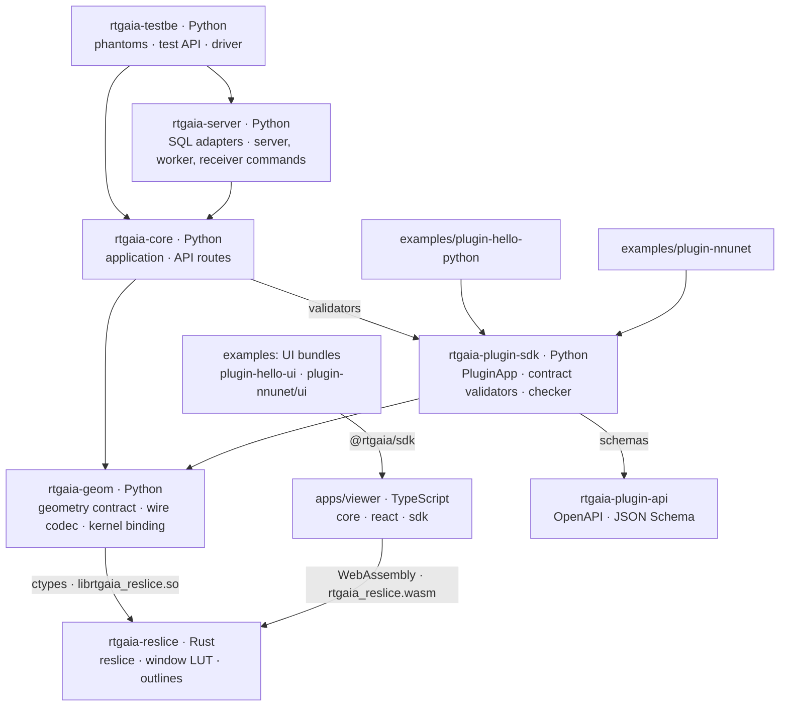
```mermaid
flowchart TB
    TESTBE["rtgaia-testbe · Python<br/>phantoms · test API · driver"]
    SERVER["rtgaia-server · Python<br/>SQL adapters · server, worker, receiver commands"]
    HELLO["examples/plugin-hello-python"]
    NNUNET["examples/plugin-nnunet"]
    UIB["examples: UI bundles<br/>plugin-hello-ui · plugin-nnunet/ui"]
    CORE["rtgaia-core · Python<br/>application · API routes"]
    VIEWER["apps/viewer · TypeScript<br/>core · react · sdk"]
    SDK["rtgaia-plugin-sdk · Python<br/>PluginApp · contract validators · checker"]
    GEOM["rtgaia-geom · Python<br/>geometry contract · wire codec · kernel binding"]
    PAPI["rtgaia-plugin-api<br/>OpenAPI · JSON Schema"]
    RESLICE["rtgaia-reslice · Rust<br/>reslice · window LUT · outlines"]
    TESTBE --> SERVER
    TESTBE --> CORE
    SERVER --> CORE
    CORE -- "validators" --> SDK
    CORE --> GEOM
    SDK --> GEOM
    SDK -- "schemas" --> PAPI
    HELLO --> SDK
    NNUNET --> SDK
    UIB -- "@rtgaia/sdk" --> VIEWER
    GEOM -- "ctypes · librtgaia_reslice.so" --> RESLICE
    VIEWER -- "WebAssembly · rtgaia_reslice.wasm" --> RESLICE
```

### Deployment

The Docker Compose deployment (`deploy/docker-compose.yml`, `deploy/Dockerfile`, `deploy/nginx.conf`).
In development, `scripts/dev.sh` runs `rtgaia-testbe` and the Vite server instead, and jobs run inside
the API process unless `RTGAIA_INPROCESS_WORKER=0`. The DICOM receiver runs in the API process by
default, or as `rtgaia-scp`.

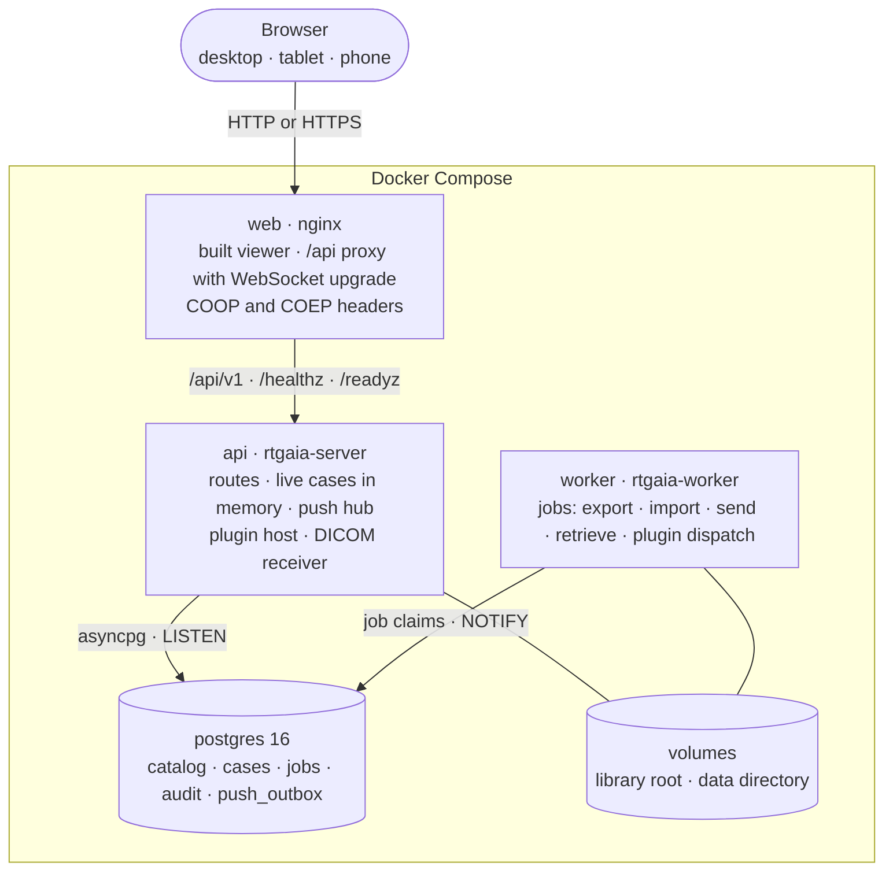
```mermaid
flowchart TB
    USER(["Browser<br/>desktop · tablet · phone"])
    subgraph COMPOSE["Docker Compose"]
        WEBSVC["web · nginx<br/>built viewer · /api proxy with WebSocket upgrade<br/>COOP and COEP headers"]
        API["api · rtgaia-server<br/>routes · live cases in memory · push hub<br/>plugin host · DICOM receiver"]
        WORKER["worker · rtgaia-worker<br/>jobs: export · import · send · retrieve · plugin dispatch"]
        PG[("postgres 16<br/>catalog · cases · jobs · audit · push_outbox")]
        VOL[("volumes<br/>library root · data directory")]
    end
    USER -- "HTTP or HTTPS" --> WEBSVC
    WEBSVC -- "/api/v1 · /healthz · /readyz" --> API
    API -- "asyncpg · LISTEN" --> PG
    WORKER -- "job claims · NOTIFY" --> PG
    API --- VOL
    WORKER --- VOL
```

### External systems

Who talks to DICOM nodes and plugin services. Interactive queries run in the API process; sending and
retrieving run as jobs. A plugin is dispatched by the process that runs the job, and calls back to the
API.

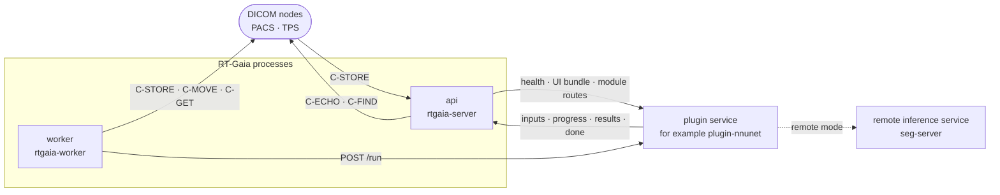
```mermaid
flowchart LR
    NODES(["DICOM nodes<br/>PACS · TPS"])
    subgraph RTG["RT-Gaia processes"]
        API["api<br/>rtgaia-server"]
        WORKER["worker<br/>rtgaia-worker"]
    end
    PLUGIN["plugin service<br/>for example plugin-nnunet"]
    SEG["remote inference service<br/>seg-server"]
    NODES -- "C-STORE" --> API
    API -- "C-ECHO · C-FIND" --> NODES
    WORKER -- "C-STORE · C-MOVE · C-GET" --> NODES
    API -- "health · UI bundle · module routes" --> PLUGIN
    WORKER -- "POST /run" --> PLUGIN
    PLUGIN -- "inputs · progress · results · done" --> API
    PLUGIN -. "remote mode" .-> SEG
```

## Class diagrams

### Geometry contract

`packages/rtgaia-geom/src/rtgaia_geom` (`grid.py`, `display_grid.py`, `frame_group.py`, `temporal.py`,
`provenance.py`, `payload.py`, `errors.py`), mirrored in TypeScript in `apps/viewer/src/core/geometry`.
All types are frozen dataclasses whose invariants are checked on construction; a violation raises
`ContractViolation`, returned by the API as HTTP 400. References by id (`mask_grid_id`,
`display_grid_id`, `grid_ref`) are drawn as dependencies.

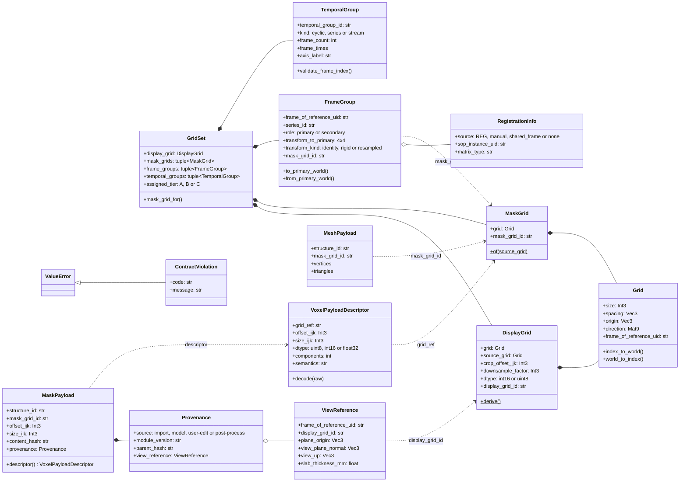
```mermaid
classDiagram
    direction LR
    class Grid {
        +size: Int3
        +spacing: Vec3
        +origin: Vec3
        +direction: Mat9
        +frame_of_reference_uid: str
        +index_to_world()
        +world_to_index()
    }
    class DisplayGrid {
        +grid: Grid
        +source_grid: Grid
        +crop_offset_ijk: Int3
        +downsample_factor: Int3
        +dtype: int16 or uint8
        +display_grid_id: str
        +derive()$
    }
    class MaskGrid {
        +grid: Grid
        +mask_grid_id: str
        +of(source_grid)$
    }
    class GridSet {
        +display_grid: DisplayGrid
        +mask_grids: tuple~MaskGrid~
        +frame_groups: tuple~FrameGroup~
        +temporal_groups: tuple~TemporalGroup~
        +assigned_tier: A, B or C
        +mask_grid_for()
    }
    class FrameGroup {
        +frame_of_reference_uid: str
        +series_id: str
        +role: primary or secondary
        +transform_to_primary: 4x4
        +transform_kind: identity, rigid or resampled
        +mask_grid_id: str
        +to_primary_world()
        +from_primary_world()
    }
    class RegistrationInfo {
        +source: REG, manual, shared_frame or none
        +sop_instance_uid: str
        +matrix_type: str
    }
    class TemporalGroup {
        +temporal_group_id: str
        +kind: cyclic, series or stream
        +frame_count: int
        +frame_times
        +axis_label: str
        +validate_frame_index()
    }
    class ViewReference {
        +frame_of_reference_uid: str
        +display_grid_id: str
        +plane_origin: Vec3
        +view_plane_normal: Vec3
        +view_up: Vec3
        +slab_thickness_mm: float
    }
    class Provenance {
        +source: import, model, user-edit or post-process
        +module_version: str
        +parent_hash: str
        +view_reference: ViewReference
    }
    class VoxelPayloadDescriptor {
        +grid_ref: str
        +offset_ijk: Int3
        +size_ijk: Int3
        +dtype: uint8, int16 or float32
        +components: int
        +semantics: str
        +decode(raw)
    }
    class MaskPayload {
        +structure_id: str
        +mask_grid_id: str
        +offset_ijk: Int3
        +size_ijk: Int3
        +content_hash: str
        +provenance: Provenance
        +descriptor() VoxelPayloadDescriptor
    }
    class MeshPayload {
        +structure_id: str
        +mask_grid_id: str
        +vertices
        +triangles
    }
    class ContractViolation {
        +code: str
        +message: str
    }
    DisplayGrid *-- Grid
    MaskGrid *-- Grid
    GridSet *-- DisplayGrid
    GridSet *-- MaskGrid
    GridSet *-- FrameGroup
    GridSet *-- TemporalGroup
    FrameGroup o-- RegistrationInfo
    FrameGroup ..> MaskGrid : mask_grid_id
    Provenance o-- ViewReference
    ViewReference ..> DisplayGrid : display_grid_id
    MaskPayload *-- Provenance
    MaskPayload ..> VoxelPayloadDescriptor : descriptor
    VoxelPayloadDescriptor ..> MaskGrid : grid_ref
    MeshPayload ..> MaskGrid : mask_grid_id
    ValueError <|-- ContractViolation
```

### Application state

`packages/rtgaia-core/src/rtgaia_core`: `AppState` in `api/deps.py`, `Case` and `Session` in
`state.py`, `SessionStore` in `session_store.py`, `StructureState` and `StructureVersion` in
`structure_state.py`, `Dataset` in `dataset.py`, `PushHub` in `push.py`. A case is the shared working
state of a selection; a session is one user's display negotiation, and many sessions share one case.
Structure sets, review events and measurements are plain dictionaries on the case. Geometry types
(`FrameGroup`, `MaskGrid`, `GridSet` and others) are those of the previous diagram.

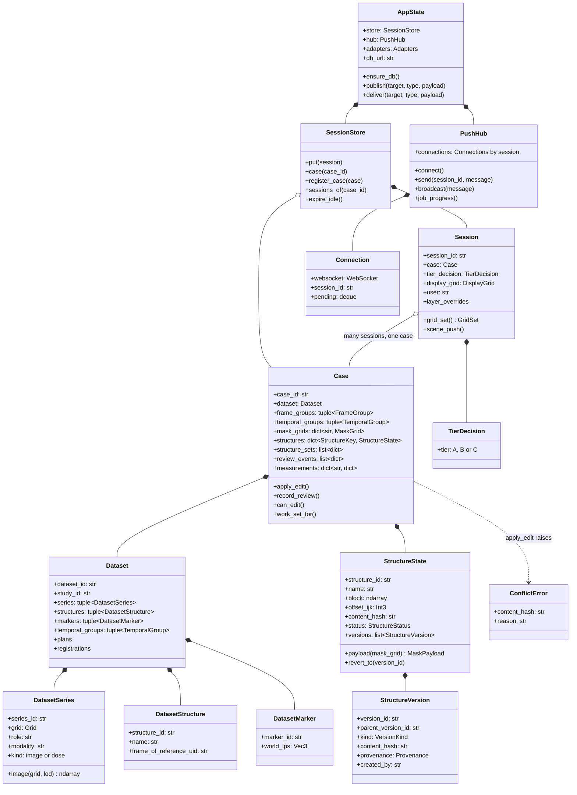
```mermaid
classDiagram
    class AppState {
        +store: SessionStore
        +hub: PushHub
        +adapters: Adapters
        +db_url: str
        +ensure_db()
        +publish(target, type, payload)
        +deliver(target, type, payload)
    }
    class SessionStore {
        +put(session)
        +case(case_id)
        +register_case(case)
        +sessions_of(case_id)
        +expire_idle()
    }
    class Session {
        +session_id: str
        +case: Case
        +tier_decision: TierDecision
        +display_grid: DisplayGrid
        +user: str
        +layer_overrides
        +grid_set() GridSet
        +scene_push()
    }
    class Case {
        +case_id: str
        +dataset: Dataset
        +frame_groups: tuple~FrameGroup~
        +temporal_groups: tuple~TemporalGroup~
        +mask_grids: dict~str, MaskGrid~
        +structures: dict~StructureKey, StructureState~
        +structure_sets: list~dict~
        +review_events: list~dict~
        +measurements: dict~str, dict~
        +apply_edit()
        +record_review()
        +can_edit()
        +work_set_for()
    }
    class StructureState {
        +structure_id: str
        +name: str
        +block: ndarray
        +offset_ijk: Int3
        +content_hash: str
        +status: StructureStatus
        +versions: list~StructureVersion~
        +payload(mask_grid) MaskPayload
        +revert_to(version_id)
    }
    class StructureVersion {
        +version_id: str
        +parent_version_id: str
        +kind: VersionKind
        +content_hash: str
        +provenance: Provenance
        +created_by: str
    }
    class Dataset {
        +dataset_id: str
        +study_id: str
        +series: tuple~DatasetSeries~
        +structures: tuple~DatasetStructure~
        +markers: tuple~DatasetMarker~
        +temporal_groups: tuple~TemporalGroup~
        +plans
        +registrations
    }
    class DatasetSeries {
        +series_id: str
        +grid: Grid
        +role: str
        +modality: str
        +kind: image or dose
        +image(grid, lod) ndarray
    }
    class DatasetStructure {
        +structure_id: str
        +name: str
        +frame_of_reference_uid: str
    }
    class DatasetMarker {
        +marker_id: str
        +world_lps: Vec3
    }
    class TierDecision {
        +tier: A, B or C
    }
    class PushHub {
        +connections: Connections by session
        +connect()
        +send(session_id, message)
        +broadcast(message)
        +job_progress()
    }
    class Connection {
        +websocket: WebSocket
        +session_id: str
        +pending: deque
    }
    class ConflictError {
        +content_hash: str
        +reason: str
    }
    AppState *-- SessionStore
    AppState *-- PushHub
    SessionStore *-- Session
    SessionStore o-- Case
    Session o-- Case : many sessions, one case
    Session *-- TierDecision
    Case *-- Dataset
    Case *-- StructureState
    StructureState *-- StructureVersion
    Dataset *-- DatasetSeries
    Dataset *-- DatasetStructure
    Dataset *-- DatasetMarker
    PushHub *-- Connection
    Case ..> ConflictError : apply_edit raises
```

### Persistence ports and adapters

`packages/rtgaia-core/src/rtgaia_core/ports.py` declares what the application needs from storage;
`rtgaia-core` provides in-memory implementations, so the backend runs without a database, and
`packages/rtgaia-server/src/rtgaia_server/db` provides the PostgreSQL ones, created by `SqlAdapters`.
`AppState` asks the adapters for each store when `RTGAIA_DB_URL` is set and uses the in-memory class
otherwise. The catalog, case and audit stores exist only in SQL; without a database the library index
and the session store keep that state in memory. The user store is used directly by `AppState`.

```mermaid
classDiagram
    class Adapters {
        <<Protocol>>
        +catalog_store(db_url)
        +upgrade_to_head()
        +case_store(engine)
        +rebuild_structures()
        +audit_store(engine)
        +user_store(engine)
        +nodes(engine)
        +settings(engine)
        +plugins(engine)
        +job_queue(engine)
        +export_records(engine)
        +storage_locations(engine)
        +bus(engine, deliver)
    }
    class SqlAdapters {
        <<rtgaia-server>>
    }
    class CatalogRepository {
        <<Protocol>>
        +ping()
        +counts()
        +dispose()
    }
    class CaseRepository {
        <<Protocol>>
        +persist()
        +load()
        +find_by_selection()
        +adopt_work_sets()
        +worklist_rows()
    }
    class AuditRepository {
        <<Protocol>>
        +append()
    }
    class NodeRepository {
        <<Protocol>>
        +list()
        +get()
        +put()
        +delete()
    }
    class SettingsRepository {
        <<Protocol>>
        +get()
        +meta()
        +put()
    }
    class PluginRepository {
        <<Protocol>>
        +list()
        +get()
        +put()
        +delete()
    }
    class ExportRecordRepository {
        <<Protocol>>
        +put()
        +get()
        +list()
    }
    class JobQueue {
        <<Protocol>>
        +enqueue()
        +claim()
        +update()
        +heartbeat()
        +reclaim_expired()
    }
    class EventBus {
        <<Protocol>>
        +publish()
        +start()
        +stop()
    }
    class BlobStore {
        <<Protocol>>
    }
    class CatalogStore {
        <<rtgaia-server>>
    }
    class CaseStore {
        <<rtgaia-server>>
    }
    class AuditStore {
        <<rtgaia-server>>
    }
    class DbNodes {
        <<rtgaia-server>>
    }
    class DbSettings {
        <<rtgaia-server>>
    }
    class DbPlugins {
        <<rtgaia-server>>
    }
    class DbExportRecords {
        <<rtgaia-server>>
    }
    class DbJobQueue {
        <<rtgaia-server>>
    }
    class PgBus {
        <<rtgaia-server>>
    }
    class MemoryNodes {
        <<rtgaia-core>>
    }
    class MemorySettings {
        <<rtgaia-core>>
    }
    class MemoryPlugins {
        <<rtgaia-core>>
    }
    class MemoryExportRecords {
        <<rtgaia-core>>
    }
    class MemoryJobQueue {
        <<rtgaia-core>>
    }
    class LocalBus {
        <<rtgaia-core>>
    }
    class FsBlobStore {
        <<rtgaia-core>>
    }
    SqlAdapters ..|> Adapters
    CatalogStore ..|> CatalogRepository
    CaseStore ..|> CaseRepository
    AuditStore ..|> AuditRepository
    DbNodes ..|> NodeRepository
    MemoryNodes ..|> NodeRepository
    DbSettings ..|> SettingsRepository
    MemorySettings ..|> SettingsRepository
    DbPlugins ..|> PluginRepository
    MemoryPlugins ..|> PluginRepository
    DbExportRecords ..|> ExportRecordRepository
    MemoryExportRecords ..|> ExportRecordRepository
    DbJobQueue ..|> JobQueue
    MemoryJobQueue ..|> JobQueue
    PgBus ..|> EventBus
    LocalBus ..|> EventBus
    FsBlobStore ..|> BlobStore
    CaseStore o-- BlobStore
```

### Jobs and the plugin host

`rtgaia_core/jobs.py` and `rtgaia_core/plugins.py`. A job is claimed under a lease that the worker
renews; plugin runs are jobs whose dispatch returns early and that complete when the plugin calls back
with its own job-scoped token. `PluginManager` also checks plugin health, reloads a manifest when the
plugin's version changes and quarantines a plugin whose UI bundle no longer matches its pinned digest.

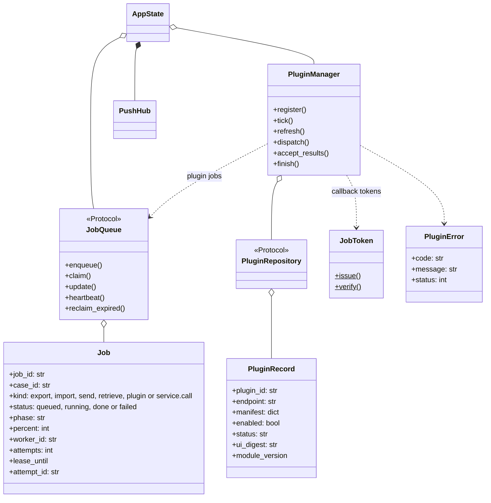
```mermaid
classDiagram
    class Job {
        +job_id: str
        +case_id: str
        +kind: export, import, send, retrieve, plugin or service.call
        +status: queued, running, done or failed
        +phase: str
        +percent: int
        +worker_id: str
        +attempts: int
        +lease_until
        +attempt_id: str
    }
    class JobQueue {
        <<Protocol>>
        +enqueue()
        +claim()
        +update()
        +heartbeat()
        +reclaim_expired()
    }
    class PluginManager {
        +register()
        +tick()
        +refresh()
        +dispatch()
        +accept_results()
        +finish()
    }
    class PluginRecord {
        +plugin_id: str
        +endpoint: str
        +manifest: dict
        +enabled: bool
        +status: str
        +ui_digest: str
        +module_version
    }
    class PluginRepository {
        <<Protocol>>
    }
    class JobToken {
        +issue()$
        +verify()$
    }
    class PluginError {
        +code: str
        +message: str
        +status: int
    }
    class PushHub
    class AppState
    JobQueue o-- Job
    AppState o-- JobQueue
    AppState o-- PluginManager
    AppState *-- PushHub
    PluginManager o-- PluginRepository
    PluginRepository o-- PluginRecord
    PluginManager ..> JobToken : callback tokens
    PluginManager ..> PluginError
    PluginManager ..> JobQueue : plugin jobs
```

### Library, import and DICOM networking

`rtgaia_core/library/` (`index.py`, `catalog.py`, `importer.py`, `scan.py`), `rtgaia_core/dimse.py` and
`rtgaia_core/settings.py`. The library index holds one header per DICOM instance; the catalog derives
the patient, study and series tree with RT objects attached to their images. The outgoing DICOM
operations are module-level functions; the receiver hands each finished association to an import job.

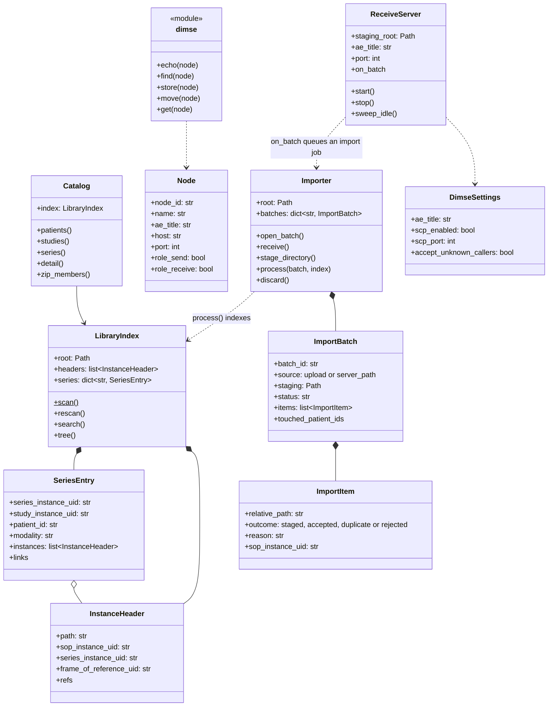
```mermaid
classDiagram
    class LibraryIndex {
        +root: Path
        +headers: list~InstanceHeader~
        +series: dict~str, SeriesEntry~
        +scan()$
        +rescan()
        +search()
        +tree()
    }
    class SeriesEntry {
        +series_instance_uid: str
        +study_instance_uid: str
        +patient_id: str
        +modality: str
        +instances: list~InstanceHeader~
        +links
    }
    class InstanceHeader {
        +path: str
        +sop_instance_uid: str
        +series_instance_uid: str
        +frame_of_reference_uid: str
        +refs
    }
    class Catalog {
        +index: LibraryIndex
        +patients()
        +studies()
        +series()
        +detail()
        +zip_members()
    }
    class Importer {
        +root: Path
        +batches: dict~str, ImportBatch~
        +open_batch()
        +receive()
        +stage_directory()
        +process(batch, index)
        +discard()
    }
    class ImportBatch {
        +batch_id: str
        +source: upload or server_path
        +staging: Path
        +status: str
        +items: list~ImportItem~
        +touched_patient_ids
    }
    class ImportItem {
        +relative_path: str
        +outcome: staged, accepted, duplicate or rejected
        +reason: str
        +sop_instance_uid: str
    }
    class Node {
        +node_id: str
        +name: str
        +ae_title: str
        +host: str
        +port: int
        +role_send: bool
        +role_receive: bool
    }
    class ReceiveServer {
        +staging_root: Path
        +ae_title: str
        +port: int
        +on_batch
        +start()
        +stop()
        +sweep_idle()
    }
    class DimseSettings {
        +ae_title: str
        +scp_enabled: bool
        +scp_port: int
        +accept_unknown_callers: bool
    }
    class dimse {
        <<module>>
        +echo(node)
        +find(node)
        +store(node)
        +move(node)
        +get(node)
    }
    LibraryIndex *-- InstanceHeader
    LibraryIndex *-- SeriesEntry
    SeriesEntry o-- InstanceHeader
    Catalog --> LibraryIndex
    Importer *-- ImportBatch
    ImportBatch *-- ImportItem
    Importer ..> LibraryIndex : process() indexes
    ReceiveServer ..> DimseSettings
    ReceiveServer ..> Importer : on_batch queues an import job
    dimse ..> Node
```

### Viewer core

`apps/viewer/src/core`: `scene/` (`ViewerHost`, `SceneManager`, `volumeStore.ts`,
`CpuViewportRenderer`), `raster/` (kernel and layer renderers), `edit/`, `interaction/`, `overlay/`
and `transport/`. `ViewerHost` owns everything that draws and edits; each viewport cell gets a binding
with its own renderer, input layer and SVG overlay. There is no camera class: a camera is a
`ViewReference` value moved by the pure functions in `core/scene/cameras.ts`. `SceneManager` tracks
layers and their memory residency. The React `App` owns the HTTP client and the push channel and creates
the host through `useScene`.

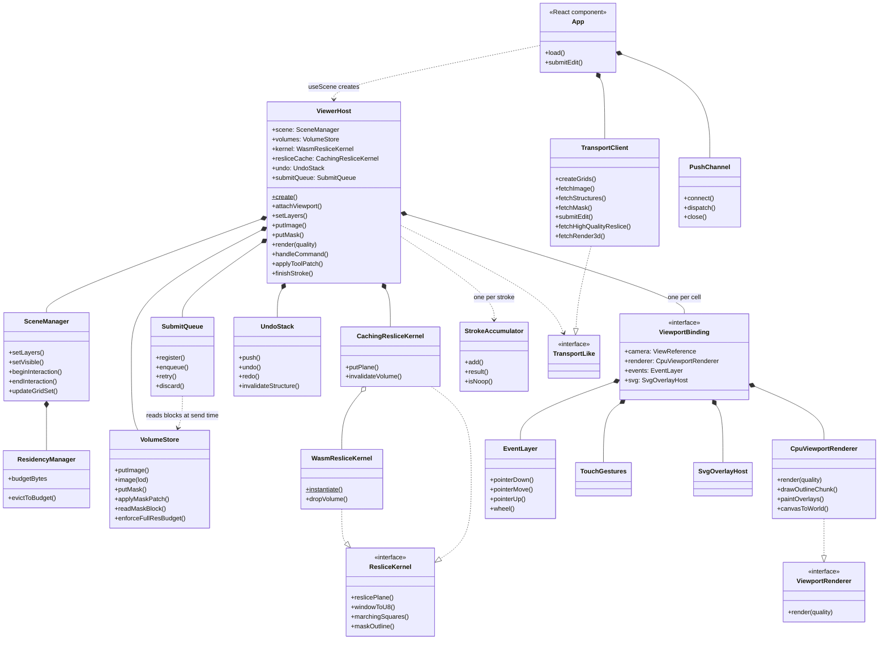
```mermaid
classDiagram
    class App {
        <<React component>>
        +load()
        +submitEdit()
    }
    class ViewerHost {
        +scene: SceneManager
        +volumes: VolumeStore
        +kernel: WasmResliceKernel
        +resliceCache: CachingResliceKernel
        +undo: UndoStack
        +submitQueue: SubmitQueue
        +create()$
        +attachViewport()
        +setLayers()
        +putImage()
        +putMask()
        +render(quality)
        +handleCommand()
        +applyToolPatch()
        +finishStroke()
    }
    class ViewportBinding {
        <<interface>>
        +camera: ViewReference
        +renderer: CpuViewportRenderer
        +events: EventLayer
        +svg: SvgOverlayHost
    }
    class SceneManager {
        +setLayers()
        +setVisible()
        +beginInteraction()
        +endInteraction()
        +updateGridSet()
    }
    class ResidencyManager {
        +budgetBytes
        +evictToBudget()
    }
    class VolumeStore {
        +putImage()
        +image(lod)
        +putMask()
        +applyMaskPatch()
        +readMaskBlock()
        +enforceFullResBudget()
    }
    class ViewportRenderer {
        <<interface>>
        +render(quality)
    }
    class CpuViewportRenderer {
        +render(quality)
        +drawOutlineChunk()
        +paintOverlays()
        +canvasToWorld()
    }
    class ResliceKernel {
        <<interface>>
        +reslicePlane()
        +windowToU8()
        +marchingSquares()
        +maskOutline()
    }
    class WasmResliceKernel {
        +instantiate()$
        +dropVolume()
    }
    class CachingResliceKernel {
        +putPlane()
        +invalidateVolume()
    }
    class UndoStack {
        +push()
        +undo()
        +redo()
        +invalidateStructure()
    }
    class SubmitQueue {
        +register()
        +enqueue()
        +retry()
        +discard()
    }
    class StrokeAccumulator {
        +add()
        +result()
        +isNoop()
    }
    class EventLayer {
        +pointerDown()
        +pointerMove()
        +pointerUp()
        +wheel()
    }
    class TouchGestures
    class SvgOverlayHost
    class TransportLike {
        <<interface>>
    }
    class TransportClient {
        +createGrids()
        +fetchImage()
        +fetchStructures()
        +fetchMask()
        +submitEdit()
        +fetchHighQualityReslice()
        +fetchRender3d()
    }
    class PushChannel {
        +connect()
        +dispatch()
        +close()
    }
    ViewerHost *-- SceneManager
    ViewerHost *-- VolumeStore
    ViewerHost *-- CachingResliceKernel
    ViewerHost *-- UndoStack
    ViewerHost *-- SubmitQueue
    ViewerHost *-- ViewportBinding : one per cell
    ViewportBinding *-- CpuViewportRenderer
    ViewportBinding *-- EventLayer
    ViewportBinding *-- SvgOverlayHost
    ViewportBinding *-- TouchGestures
    SceneManager *-- ResidencyManager
    CpuViewportRenderer ..|> ViewportRenderer
    WasmResliceKernel ..|> ResliceKernel
    CachingResliceKernel ..|> ResliceKernel
    CachingResliceKernel o-- WasmResliceKernel
    ViewerHost ..> StrokeAccumulator : one per stroke
    ViewerHost ..> TransportLike
    TransportClient ..|> TransportLike
    SubmitQueue ..> VolumeStore : reads blocks at send time
    App *-- TransportClient
    App *-- PushChannel
    App ..> ViewerHost : useScene creates
```

### Plugin SDK

`packages/rtgaia-plugin-sdk/src/rtgaia_plugin_sdk`: `PluginApp` (`server.py`) turns a manifest and a
`run(ctx)` function into the plugin's HTTP service; `RunContext` talks to the host through
`HostCallback` (`host_client.py`). The validators in `contract.py` are shared by the SDK, the
`rtgaia-plugin-check` tool (`check.py`) and the host. See [plugins.md](plugins.md) and
[plugin-contract.md](plugin-contract.md).

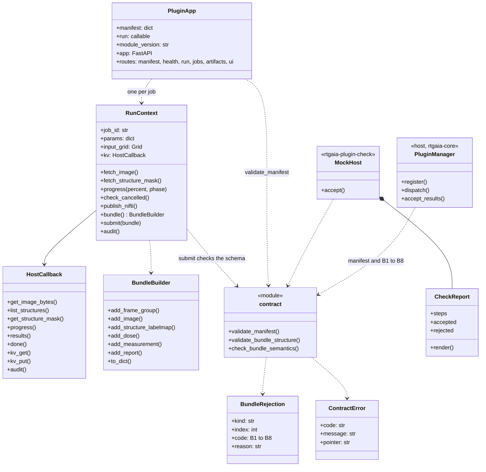
```mermaid
classDiagram
    class PluginApp {
        +manifest: dict
        +run: callable
        +module_version: str
        +app: FastAPI
        +routes: manifest, health, run, jobs, artifacts, ui
    }
    class RunContext {
        +job_id: str
        +params: dict
        +input_grid: Grid
        +kv: HostCallback
        +fetch_image()
        +fetch_structure_mask()
        +progress(percent, phase)
        +check_cancelled()
        +publish_nifti()
        +bundle() BundleBuilder
        +submit(bundle)
        +audit()
    }
    class HostCallback {
        +get_image_bytes()
        +list_structures()
        +get_structure_mask()
        +progress()
        +results()
        +done()
        +kv_get()
        +kv_put()
        +audit()
    }
    class BundleBuilder {
        +add_frame_group()
        +add_image()
        +add_structure_labelmap()
        +add_dose()
        +add_measurement()
        +add_report()
        +to_dict()
    }
    class contract {
        <<module>>
        +validate_manifest()
        +validate_bundle_structure()
        +check_bundle_semantics()
    }
    class BundleRejection {
        +kind: str
        +index: int
        +code: B1 to B8
        +reason: str
    }
    class ContractError {
        +code: str
        +message: str
        +pointer: str
    }
    class MockHost {
        <<rtgaia-plugin-check>>
        +accept()
    }
    class CheckReport {
        +steps
        +accepted
        +rejected
        +render()
    }
    class PluginManager {
        <<host, rtgaia-core>>
        +register()
        +dispatch()
        +accept_results()
    }
    PluginApp ..> RunContext : one per job
    RunContext --> HostCallback
    RunContext ..> BundleBuilder
    RunContext ..> contract : submit checks the schema
    PluginApp ..> contract : validate_manifest
    MockHost ..> contract
    MockHost *-- CheckReport
    PluginManager ..> contract : manifest and B1 to B8
    contract ..> BundleRejection
    contract ..> ContractError
```

## Flowcharts

### Request pipeline

The middleware in `rtgaia_core/api/__init__.py`, from the outside in. The audit middleware runs the
request first and records successful writes afterwards; if the audit trail cannot be written, the
request fails with 503 even though the change has happened. WebSocket connections skip this pipeline and
check the token themselves.

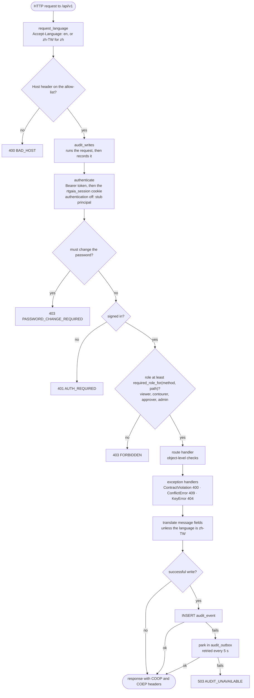
```mermaid
flowchart TB
    REQ(["HTTP request to /api/v1"]) --> LANG["request_language<br/>Accept-Language: en, or zh-TW for zh"]
    LANG --> HOST{"Host header on the allow-list?"}
    HOST -- no --> E400["400 BAD_HOST"]
    HOST -- yes --> AUD["audit_writes<br/>runs the request, then records it"]
    AUD --> AUTH["authenticate<br/>Bearer token, then the rtgaia_session cookie<br/>authentication off: stub principal"]
    AUTH --> PWD{"must change the password?"}
    PWD -- yes --> E403P["403 PASSWORD_CHANGE_REQUIRED"]
    PWD -- no --> PRIN{"signed in?"}
    PRIN -- no --> E401["401 AUTH_REQUIRED"]
    PRIN -- yes --> ROLE{"role at least required_role_for(method, path)?<br/>viewer, contourer, approver, admin"}
    ROLE -- no --> E403["403 FORBIDDEN"]
    ROLE -- yes --> ROUTE["route handler<br/>object-level checks"]
    ROUTE --> EXC["exception handlers<br/>ContractViolation 400 · ConflictError 409 · KeyError 404"]
    EXC --> TRANS["translate message fields<br/>unless the language is zh-TW"]
    TRANS --> WRITE{"successful write?"}
    WRITE -- no --> RESP(["response with COOP and COEP headers"])
    WRITE -- yes --> AE["INSERT audit_event"]
    AE -- ok --> RESP
    AE -- fails --> OUTBOX["park in audit_outbox<br/>retried every 5 s"]
    OUTBOX -- ok --> RESP
    OUTBOX -- fails --> E503["503 AUDIT_UNAVAILABLE"]
```

### Import

All import sources share one pipeline (`rtgaia_core/library/importer.py`). Browser uploads and
server-directory imports run as background tasks in the API process, and the library page follows the
batch until it is done; DICOM reception and retrieval run as import jobs (`run_import` in
`rtgaia_core/jobs.py`), which publish `catalog.changed` when they finish. The library page does not
listen for that event; it shows new data when it next loads the tree.

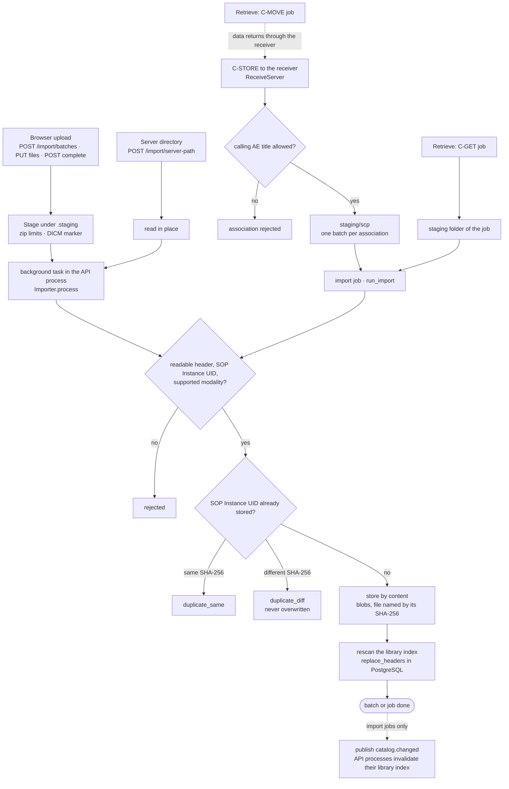
```mermaid
flowchart TB
    UP["Browser upload<br/>POST /import/batches · PUT files · POST complete"] --> STAGE["Stage under .staging<br/>zip limits · DICM marker"]
    SP["Server directory<br/>POST /import/server-path"] --> INPLACE["read in place"]
    SCP["C-STORE to the receiver<br/>ReceiveServer"] --> ALLOW{"calling AE title allowed?"}
    ALLOW -- no --> RJ["association rejected"]
    ALLOW -- yes --> BATCH["staging/scp<br/>one batch per association"]
    MOVE["Retrieve: C-MOVE job"] -. "data returns through the receiver" .-> SCP
    GET["Retrieve: C-GET job"] --> GETDIR["staging folder of the job"]
    STAGE --> BG["background task in the API process<br/>Importer.process"]
    INPLACE --> BG
    BATCH --> JOB["import job · run_import"]
    GETDIR --> JOB
    BG --> VAL
    JOB --> VAL
    VAL{"readable header, SOP Instance UID,<br/>supported modality?"}
    VAL -- no --> REJ["rejected"]
    VAL -- yes --> SEEN{"SOP Instance UID already stored?"}
    SEEN -- "same SHA-256" --> DS["duplicate_same"]
    SEEN -- "different SHA-256" --> DD["duplicate_diff<br/>never overwritten"]
    SEEN -- no --> STORE["store by content<br/>blobs, file named by its SHA-256"]
    STORE --> IDX["rescan the library index<br/>replace_headers in PostgreSQL"]
    IDX --> DONE(["batch or job done"])
    DONE -. "import jobs only" .-> CC["publish catalog.changed<br/>API processes invalidate their library index"]
```

### Opening a case

From the library page to the first frame. The server side is `create_session` in
`api/routes_library.py` and `create_grids` in `api/routes_grids.py`; the viewer side is `load()` in
`react/components/App.tsx` and the voxel loading in the same file. Images arrive at the coarsest level
first, so the first frame appears before full-resolution data.

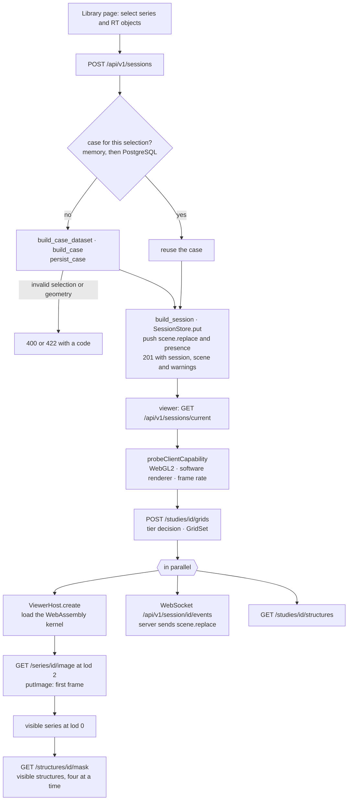
```mermaid
flowchart TB
    SEL["Library page: select series and RT objects"] --> POST["POST /api/v1/sessions"]
    POST --> FIND{"case for this selection?<br/>memory, then PostgreSQL"}
    FIND -- yes --> REUSE["reuse the case"]
    FIND -- no --> BUILD["build_case_dataset · build_case<br/>persist_case"]
    BUILD -- "invalid selection or geometry" --> E4XX["400 or 422 with a code"]
    REUSE --> SESS["build_session · SessionStore.put<br/>push scene.replace and presence<br/>201 with session, scene and warnings"]
    BUILD --> SESS
    SESS --> CUR["viewer: GET /api/v1/sessions/current"]
    CUR --> PROBE["probeClientCapability<br/>WebGL2 · software renderer · frame rate"]
    PROBE --> GRIDS["POST /studies/id/grids<br/>tier decision · GridSet"]
    GRIDS --> PAR{{"in parallel"}}
    PAR --> HOSTK["ViewerHost.create<br/>load the WebAssembly kernel"]
    PAR --> WS["WebSocket /api/v1/session/id/events<br/>server sends scene.replace"]
    PAR --> STRUCT["GET /studies/id/structures"]
    HOSTK --> LOD2["GET /series/id/image at lod 2<br/>putImage: first frame"]
    LOD2 --> LOD0["visible series at lod 0"]
    LOD0 --> MASKS["GET /structures/id/mask<br/>visible structures, four at a time"]
```

### Rendering a 2D view

`CpuViewportRenderer.render` in `core/scene/CpuViewportRenderer.ts` with the layer renderers of
`core/raster/`. Images and outlines are sampled from the same plane by the same kernel, so they align by
construction.

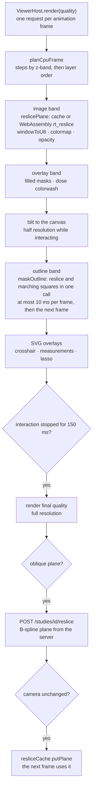
```mermaid
flowchart TB
    REQ["ViewerHost.render(quality)<br/>one request per animation frame"] --> PLAN["planCpuFrame<br/>steps by z-band, then layer order"]
    PLAN --> IMG["image band<br/>reslicePlane: cache or WebAssembly rt_reslice<br/>windowToU8 · colormap · opacity"]
    IMG --> OVL["overlay band<br/>filled masks · dose colorwash"]
    OVL --> BLIT["blit to the canvas<br/>half resolution while interacting"]
    BLIT --> OUTL["outline band<br/>maskOutline: reslice and marching squares in one call<br/>at most 10 ms per frame, then the next frame"]
    OUTL --> SVG["SVG overlays<br/>crosshair · measurements · lasso"]
    SVG --> SETTLE{"interaction stopped for 150 ms?"}
    SETTLE -- yes --> FINAL["render final quality<br/>full resolution"]
    FINAL --> OBL{"oblique plane?"}
    OBL -- yes --> HQ["POST /studies/id/reslice<br/>B-spline plane from the server"]
    HQ --> SAME{"camera unchanged?"}
    SAME -- yes --> PUT["resliceCache.putPlane<br/>the next frame uses it"]
```

### Editing a structure

A brush stroke from the pointer to every viewer of the case: `ViewerHost.applyToolPatch` and
`finishStroke`, `core/edit/submitQueue.ts`, and on the server `POST /api/v1/structures/{id}/edit` in
`api/routes_structures.py` with `Case.apply_edit`. Because a structure never has two requests in flight,
a conflict means that someone else changed it.

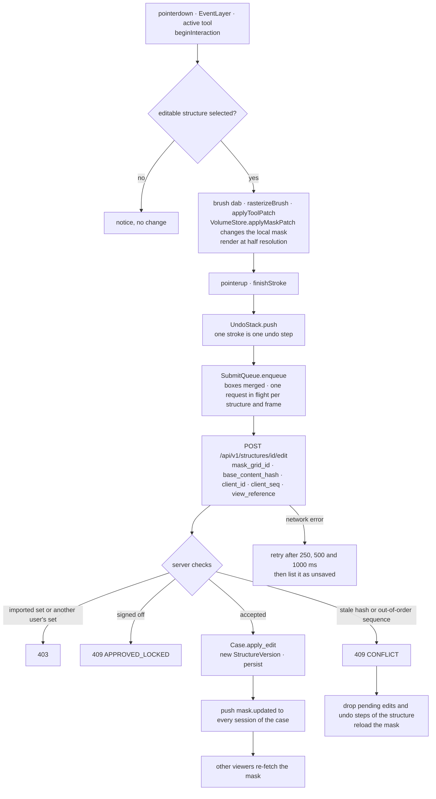
```mermaid
flowchart TB
    DOWN["pointerdown · EventLayer · active tool<br/>beginInteraction"] --> TARGET{"editable structure selected?"}
    TARGET -- no --> NOTE["notice, no change"]
    TARGET -- yes --> DAB["brush dab · rasterizeBrush · applyToolPatch<br/>VolumeStore.applyMaskPatch changes the local mask<br/>render at half resolution"]
    DAB --> UP["pointerup · finishStroke"]
    UP --> UNDO["UndoStack.push<br/>one stroke is one undo step"]
    UNDO --> ENQ["SubmitQueue.enqueue<br/>boxes merged · one request in flight per structure and frame"]
    ENQ --> POST["POST /api/v1/structures/id/edit<br/>mask_grid_id · base_content_hash · client_id · client_seq · view_reference"]
    POST --> CHECK{"server checks"}
    CHECK -- "imported set or another user's set" --> E403["403"]
    CHECK -- "signed off" --> LOCKED["409 APPROVED_LOCKED"]
    CHECK -- "stale hash or out-of-order sequence" --> CONFLICT["409 CONFLICT"]
    CHECK -- "accepted" --> VERSION["Case.apply_edit<br/>new StructureVersion · persist"]
    VERSION --> PUSH["push mask.updated to every session of the case"]
    PUSH --> OTHERS["other viewers re-fetch the mask"]
    CONFLICT --> RELOAD["drop pending edits and undo steps of the structure<br/>reload the mask"]
    POST -- "network error" --> RETRY["retry after 250, 500 and 1000 ms<br/>then list it as unsaved"]
```

### Push and HTTP fallback

Server side in `rtgaia_core/push.py`, client side in `PushChannel` (`core/transport/client.ts`) and
`withPush` (`react/components/App.tsx`, with `isCaseMutation` in `react/components/pushFallback.ts`). The WebSocket carries metadata only; voxels always
travel over HTTP.

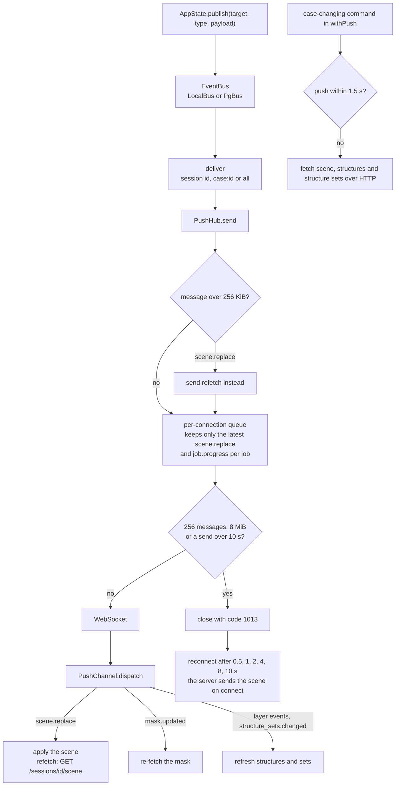
```mermaid
flowchart TB
    PUB["AppState.publish(target, type, payload)"] --> BUS["EventBus<br/>LocalBus or PgBus"]
    BUS --> DELIVER["deliver<br/>session id, case:id or all"]
    DELIVER --> SEND["PushHub.send"]
    SEND --> SIZE{"message over 256 KiB?"}
    SIZE -- "scene.replace" --> STUB["send refetch instead"]
    SIZE -- no --> QUEUE["per-connection queue<br/>keeps only the latest scene.replace<br/>and job.progress per job"]
    STUB --> QUEUE
    QUEUE --> SLOW{"256 messages, 8 MiB<br/>or a send over 10 s?"}
    SLOW -- yes --> CLOSE["close with code 1013"]
    SLOW -- no --> WS["WebSocket"]
    WS --> DISPATCH["PushChannel.dispatch"]
    DISPATCH -- "scene.replace" --> SCENE["apply the scene<br/>refetch: GET /sessions/id/scene"]
    DISPATCH -- "mask.updated" --> MASK["re-fetch the mask"]
    DISPATCH -- "layer events, structure_sets.changed" --> STRUCTS["refresh structures and sets"]
    CLOSE --> RECONNECT["reconnect after 0.5, 1, 2, 4, 8, 10 s<br/>the server sends the scene on connect"]
    CMD["case-changing command in withPush"] --> WAIT{"push within 1.5 s?"}
    WAIT -- no --> HTTP["fetch scene, structures and structure sets over HTTP"]
```

### Jobs

`worker_loop` and `run_job` in `rtgaia_core/jobs.py`, `DbJobQueue` in `rtgaia_server/db/jobs.py`. Only
an expired lease sends a job back to the queue; an exception in a handler fails the job.

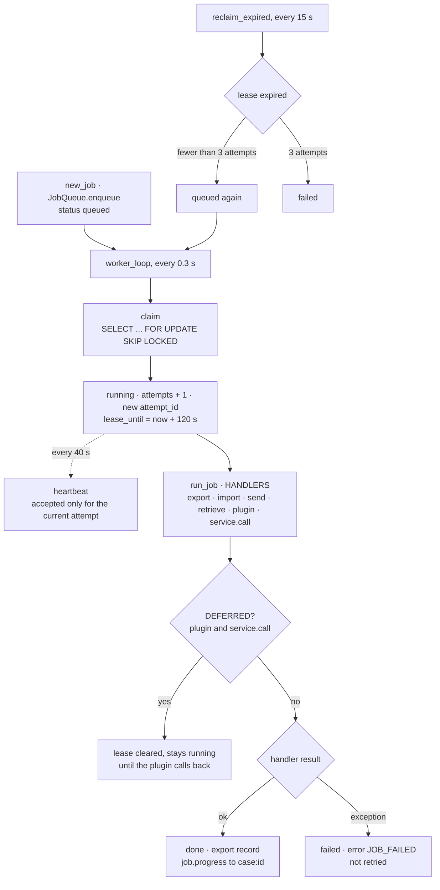
```mermaid
flowchart TB
    ENQ["new_job · JobQueue.enqueue<br/>status queued"] --> POLL["worker_loop, every 0.3 s"]
    POLL --> CLAIM["claim<br/>SELECT ... FOR UPDATE SKIP LOCKED"]
    CLAIM --> RUNNING["running · attempts + 1 · new attempt_id<br/>lease_until = now + 120 s"]
    RUNNING -. "every 40 s" .-> BEAT["heartbeat<br/>accepted only for the current attempt"]
    RUNNING --> HANDLER["run_job · HANDLERS<br/>export · import · send · retrieve · plugin · service.call"]
    HANDLER --> DEFER{"DEFERRED?<br/>plugin and service.call"}
    DEFER -- yes --> WAIT["lease cleared, stays running<br/>until the plugin calls back"]
    DEFER -- no --> RESULT{"handler result"}
    RESULT -- ok --> DONE["done · export record<br/>job.progress to case:id"]
    RESULT -- exception --> FAIL["failed · error JOB_FAILED<br/>not retried"]
    RECLAIM["reclaim_expired, every 15 s"] --> EXPIRED{"lease expired"}
    EXPIRED -- "fewer than 3 attempts" --> REQUEUE["queued again"]
    EXPIRED -- "3 attempts" --> FAIL2["failed"]
    REQUEUE --> POLL
```

### Events across processes

`PgBus` in `rtgaia_server/db/bus.py` and `AppState.deliver` in `rtgaia_core/api/deps.py`. Without a
database, `LocalBus` delivers within the one process. Workers publish but do not listen.

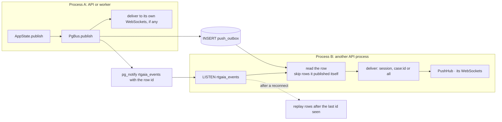
```mermaid
flowchart LR
    subgraph A["Process A: API or worker"]
        PUB["AppState.publish"] --> PG1["PgBus.publish"]
        PG1 --> LOCAL["deliver to its own WebSockets, if any"]
    end
    PG1 --> ROW[("INSERT push_outbox")]
    PG1 --> NOTIFY["pg_notify rtgaia_events with the row id"]
    subgraph B["Process B: another API process"]
        LISTEN["LISTEN rtgaia_events"] --> READ["read the row<br/>skip rows it published itself"]
        READ --> DELIVER["deliver: session, case:id or all"]
        DELIVER --> HUB["PushHub · its WebSockets"]
    end
    NOTIFY --> LISTEN
    ROW --> READ
    LISTEN -. "after a reconnect" .-> CATCHUP["replay rows after the last id seen"]
```

### Plugin run

The host side is `api/routes_plugins.py` and `PluginManager`; the plugin side is the SDK, or any service
that implements [the contract](plugin-contract.md). Results are validated before anything is stored, and
stay private to the user who ran the plugin until they are saved.

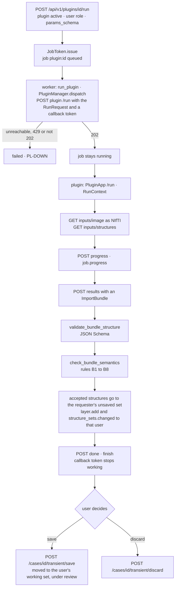
```mermaid
flowchart TB
    START["POST /api/v1/plugins/id/run<br/>plugin active · user role · params_schema"] --> TOKEN["JobToken.issue<br/>job plugin:id queued"]
    TOKEN --> DISPATCH["worker: run_plugin · PluginManager.dispatch<br/>POST plugin /run with the RunRequest and a callback token"]
    DISPATCH -- "unreachable, 429 or not 202" --> DOWN["failed · PL-DOWN"]
    DISPATCH -- "202" --> DEFER["job stays running"]
    DEFER --> PLUGIN["plugin: PluginApp /run · RunContext"]
    PLUGIN --> INPUTS["GET inputs/image as NIfTI<br/>GET inputs/structures"]
    INPUTS --> PROGRESS["POST progress · job.progress"]
    PROGRESS --> RESULTS["POST results with an ImportBundle"]
    RESULTS --> SCHEMA["validate_bundle_structure<br/>JSON Schema"]
    SCHEMA --> SEMANTICS["check_bundle_semantics<br/>rules B1 to B8"]
    SEMANTICS --> TRANSIENT["accepted structures go to the requester's unsaved set<br/>layer.add and structure_sets.changed to that user"]
    TRANSIENT --> DONE["POST done · finish<br/>callback token stops working"]
    DONE --> CHOICE{"user decides"}
    CHOICE -- save --> SAVE["POST /cases/id/transient/save<br/>moved to the user's working set, under review"]
    CHOICE -- discard --> DISCARD["POST /cases/id/transient/discard"]
```

### Review and export

Sign-off is `POST /api/v1/studies/{id}/review` (`api/routes_structures.py`); setting a structure back to
under review reopens it. Export is `run_export` in `rtgaia_core/jobs.py` with `rtgaia_core/rtstruct.py`.

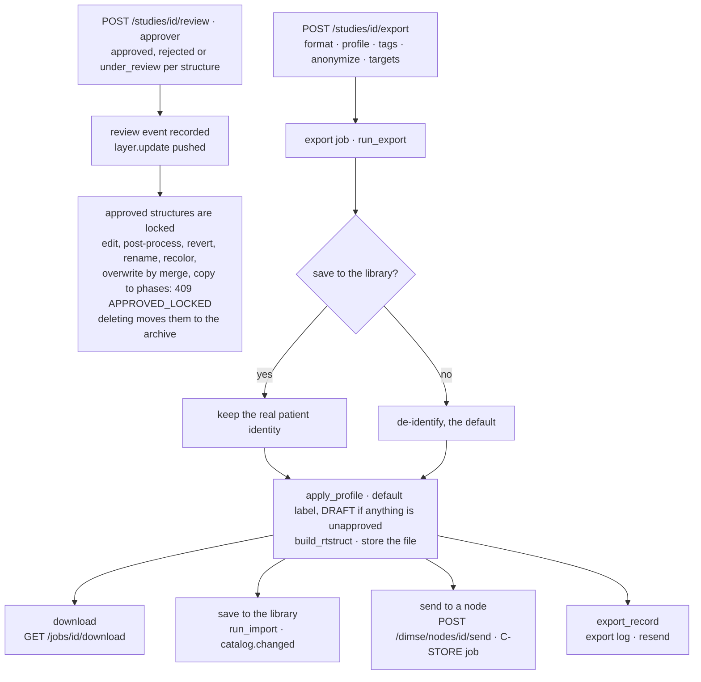
```mermaid
flowchart TB
    REVIEW["POST /studies/id/review · approver<br/>approved, rejected or under_review per structure"] --> EVENT["review event recorded<br/>layer.update pushed"]
    EVENT --> LOCK["approved structures are locked<br/>edit, post-process, revert, rename, recolor,<br/>overwrite by merge, copy to phases: 409 APPROVED_LOCKED<br/>deleting moves them to the archive"]
    EXPORT["POST /studies/id/export<br/>format · profile · tags · anonymize · targets"] --> JOB["export job · run_export"]
    JOB --> IDENTITY{"save to the library?"}
    IDENTITY -- yes --> REAL["keep the real patient identity"]
    IDENTITY -- no --> ANON["de-identify, the default"]
    REAL --> BUILD["apply_profile · default label, DRAFT if anything is unapproved<br/>build_rtstruct · store the file"]
    ANON --> BUILD
    BUILD --> DL["download<br/>GET /jobs/id/download"]
    BUILD --> LIB["save to the library<br/>run_import · catalog.changed"]
    BUILD --> SEND["send to a node<br/>POST /dimse/nodes/id/send · C-STORE job"]
    BUILD --> LOG["export_record<br/>export log · resend"]
```

### Viewer modules and plugin UIs

How the viewer is assembled at startup (`main.tsx`, `react/components/App.tsx`): feature modules and
plugin UI bundles register panels, tools, layouts and layer renderers through `registerModule()`
(`core/panels/registry.ts`), and `PanelSlot` components place the panels. A plugin UI bundle is
checked against the digest pinned at registration before any of its code runs.

```mermaid
flowchart TB
    MAIN["main.tsx<br/>registerCoreBuiltins · exposeHostSingletons<br/>installLanguageHeader · ensureLang"] --> APP["App<br/>TransportClient · useScene creates ViewerHost"]
    APP --> COREUI["registerCoreUi"]
    APP --> FEATURES["feature modules<br/>doseops · dvh · export · layout · measure · mpr · plan<br/>reflines · registration · render3d · review · roi · temporal"]
    APP --> MENU["registerPluginsModule<br/>Plugins menu"]
    APP --> LOADER["installPluginUis<br/>GET /api/v1/plugins"]
    LOADER --> TRUST{"UI bundle with trust host-equivalent<br/>and a pinned digest?"}
    TRUST -- no --> DECL["registerDeclarative<br/>form generated from params_schema"]
    TRUST -- yes --> DIGEST["verifyBundleDigest<br/>SHA-256 before running any code"]
    DIGEST -- mismatch --> SKIP["not loaded"]
    DIGEST -- match --> IMPORT["import /api/v1/plugins/id/ui/index.js<br/>validateEntry · register with @rtgaia/sdk"]
    COREUI --> REG["registerModule<br/>layer renderers, tools, layouts, panels"]
    FEATURES --> REG
    MENU --> REG
    DECL --> REG
    IMPORT --> REG
    REG --> SLOTS["PanelSlot<br/>left and right sidebars · bottom · toolbar<br/>viewport overlay · layout cells"]
```
