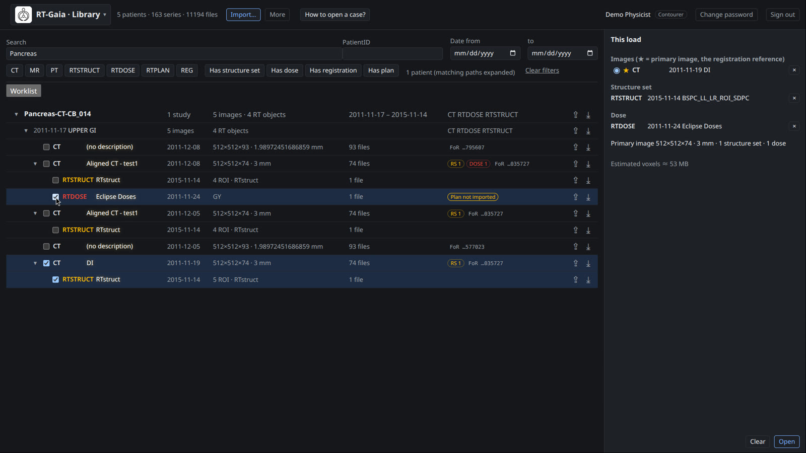
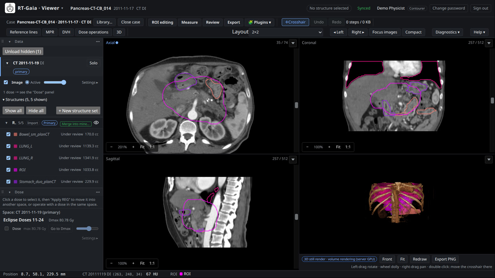
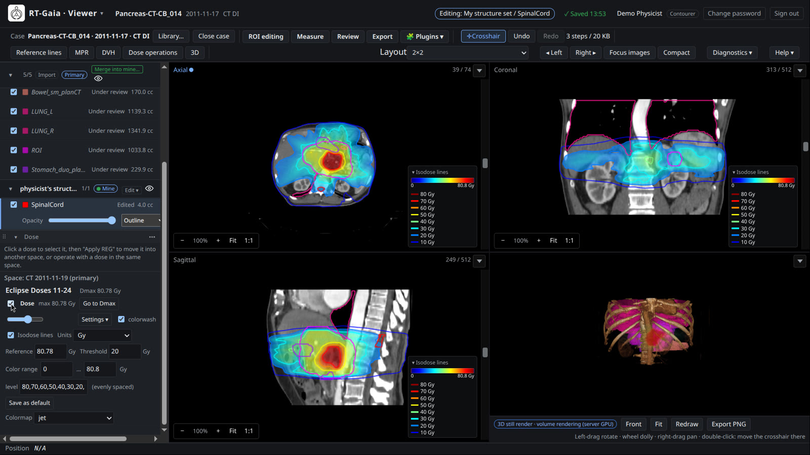
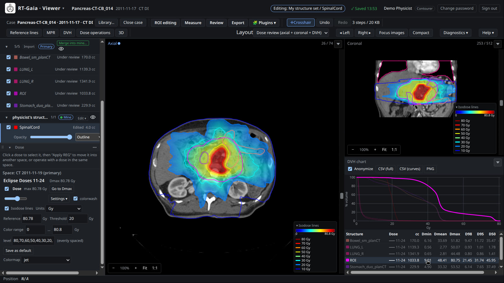
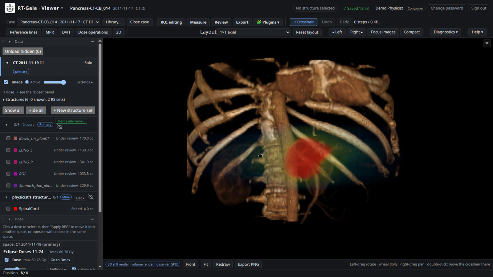
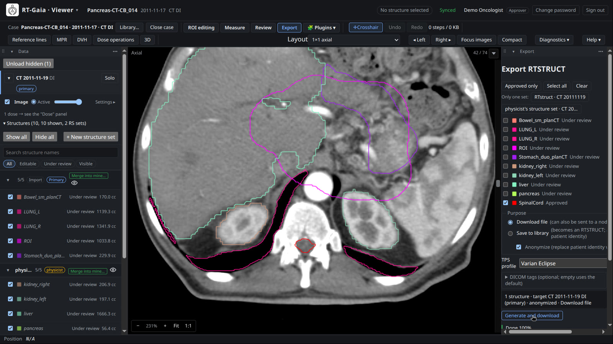
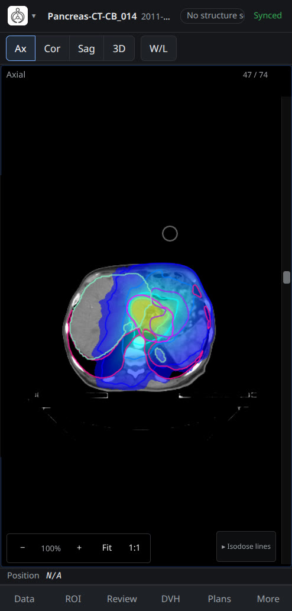

# RT-Gaia user guide

This guide explains how to use RT-Gaia in a web browser: finding and importing DICOM data, viewing images with structures, dose and plans, contouring, measuring, reviewing and exporting. It is written for clinicians, medical physicists, dosimetrists and researchers.

For installation, accounts, DICOM nodes and storage, see the [administration guide](administration.md). For writing plugins, see [plugins](plugins.md). Supported DICOM objects and network services are listed in the [DICOM conformance statement](dicom-conformance.md).

> **Research software.** RT-Gaia is research software. It is not a medical device, has not been cleared or approved by any regulatory authority, and must not be used for clinical decision making. Use only de-identified data for testing and demonstrations.

## Contents

- [Introduction](#introduction)
- [The library page](#the-library-page)
- [The viewer](#the-viewer)
- [Structures and contouring](#structures-and-contouring)
- [Dose](#dose)
- [Plans](#plans)
- [3D view](#3d-view)
- [4D and dynamic images](#4d-and-dynamic-images)
- [Measurements](#measurements)
- [Review, approval and export](#review-approval-and-export)
- [Plugins](#plugins)
- [Phones and tablets](#phones-and-tablets)
- [Settings, help and shortcuts](#settings-help-and-shortcuts)
- [Troubleshooting](#troubleshooting)

## Introduction

### What RT-Gaia is

RT-Gaia shows planning CT, CBCT, MR and PET images together with structure sets (RTSTRUCT), dose (RTDOSE), treatment plans (RTPLAN) and spatial registrations (REG). Everything you open is placed in one shared 3D space (plus time, for 4D data): a CBCT registered to the planning CT is drawn in the CT's coordinates together with its own structures and dose, and the crosshair, readout and measurements refer to the same physical point in every view.

The server does the heavy work (loading DICOM, resampling, dose statistics, 3D rendering), so your computer does not need a dedicated graphics card.

RT-Gaia has two main pages:

- The **library page** (**RT-Gaia · Library**): browse, search, import and select data.
- The **viewer** (**RT-Gaia · Viewer**): look at a case, contour, measure, review and export.

Switch pages with the brand menu: click the RT-Gaia logo and name at the top left. The same menu has **Export log**, **Trash**, the **Language** switch and, for administrators, the administration pages.

### Browser requirements

- RT-Gaia is developed and tested with Google Chrome. Use a current version of Chrome or another Chromium-based browser (for example Microsoft Edge) on a desktop computer, and Chrome on Android phones and tablets.
- Other browsers, including Safari and any browser on iPhone or iPad, are not tested.
- WebAssembly must be enabled (it is by default). Image reslicing runs in a WebAssembly module in the browser.

### Signing in

Accounts are created by an administrator. You receive a username and usually a temporary password.

1. Open the address of your RT-Gaia server. You can switch between **中文** and **English** on the sign-in page.
2. Enter your **Username** and **Password** and click **Sign in**. **Show** reveals the password while you type.
3. If the password is temporary, RT-Gaia asks you to change it before you can do anything else (**Please change your temporary password first**).

Password rules (defaults; your administrator may change the minimum length):

- at least 12 characters;
- must not contain your username;
- must not be a single repeated character or a common password.

After 5 failed attempts the account is locked for 15 minutes (default). An administrator can unlock it earlier.

You stay signed in for 12 hours in that browser. Your name and role are shown at the top right, next to **Change password** and **Sign out**. Changing your password signs out your other devices.

After signing in, RT-Gaia reopens the case you had open, or shows the library page.

A brand-new installation shows **Create the first administrator** instead of the sign-in form; see the [administration guide](administration.md). Some test installations run without accounts: there is then no sign-in page and no user name in the header.

### Roles

Every account has one role. Higher roles include everything the lower roles can do.

| Role | What it allows |
|---|---|
| **Viewer** | Browse and search the library, open cases, view images, structures, dose, plans and 3D, compute DVHs (including export) and temporary dose-operation results. Cannot change data. |
| **Contourer** | Import DICOM, pull from and send to DICOM nodes, create and edit structures in your own structure sets, measure, adjust and commit registrations, export RTSTRUCT, save dose results as RTDOSE, run plugins whose minimum role is Contourer. |
| **Approver** | Approve, reject and reopen structures. |
| **Admin** | Manage users, DICOM nodes, service settings and plugins; view the audit log and the **Archive**; remove data from the library; edit other users' structure sets. |

Each plugin declares its own minimum role; plugins you may not use are shown disabled in the **Plugins** menu.

### Help inside RT-Gaia

- **Help ▾** at the right end of the viewer's task bar offers **Keyboard and mouse** (also opened with `?` or `F1`), **Feature tour**, **Task: draw a structure** and **User guide** (a short in-app version of this guide).
- The feature tour starts automatically the first time you open a case on a computer or tablet. You can replay it from **Help ▾**.
- On the library page, **How to open a case?** walks you through opening a case.
- Hover over any button to see what it does. On touch devices, long-press the button.

## The library page

The library page lists everything in the DICOM library as a tree and lets you choose what to open together.

The header shows the number of patients, series and files, **Import…**, **More** (**Rescan**, **Compress downloads** and the library directory), **How to open a case?** and your user name.

### Searching and filtering

| Control | What it does |
|---|---|
| **Search** | Matches PatientID, study and series descriptions, structure set labels, plan labels and ROI names (for example `Parotid`). |
| **PatientID**, **Date from** … **to** | Narrow by patient and study date. |
| **CT**, **MR**, **PT**, **RTSTRUCT**, **RTDOSE**, **RTPLAN**, **REG** | Only list these modalities. |
| **Has structure set**, **Has dose**, **Has registration**, **Has plan** | Only list images that have this kind of RT object attached. |
| **Clear filters** | Reset all search text, filters and dates. |

Matching paths are expanded automatically. The list shows 50 patients per page. Patient names are hidden unless the server is configured to show them.

### The patient tree

The tree has four levels: Patient › Study › image series › RT objects. RT objects are listed under the image they belong to: structure sets, plans (with their doses underneath), doses without a plan, and registrations. RT objects whose referenced images are not in the library are grouped under **Unlinked RT objects**.

Each row shows the description, date, a summary (for example matrix size and slice thickness, ROI count, dose units, plan label and prescription), the number of files, badges and actions.

| Badge | Meaning |
|---|---|
| **RS** n, **PLAN** n, **DOSE** n, **REG** n | RT objects attached to this image. |
| **←n REG** | n registrations use this image as their fixed (target) image. |
| **FoR …** | The last characters of the Frame of Reference UID. Images with the same FoR share coordinates. |
| **Cannot decode** | The series uses a compression format that cannot be decoded. It cannot be opened, but it can still be downloaded or sent. |
| **Referenced by n plans** | The structure set is used by plans in the library. |
| **Plan not imported** | The dose refers to a plan that is not in the library. |
| **Derived dose** | The dose was created by RT-Gaia dose operations, not by a treatment planning system. |
| **rigid**, **deformable** | Registration type. Only rigid registrations can be applied. |
| **Dynamic ×N**, **Multi-echo ×N**, **b-values ×N**, **Multi-frame N** | Several images at the same position. They are split into time points or a parameter axis when the case opens. |
| **In progress**, **Under review**, **Approved**, **Exported** | Status of the case for this study (see [Worklist](#worklist)). |

Click a series description to open its details: dates, study, summary, file count, compression, scanner model, Series UID and FoR UID (each with **Copy**), the objects attached to it, **⤓ Download this series (zip)** and **⇪ Send to node (C-STORE)**.

### Selecting what to open

1. Expand a patient and a study.
2. Tick an image series (CT, CBCT, MR or PET). The structure sets, doses, registrations and plans that reference it are ticked automatically; a message tells you what was added.
3. Tick more images if you want them in the same case (for example the daily CBCTs). Ticking an RT object on its own adds only that object; unticking an image does not untick its RT objects.
4. Check the **This load** panel on the right, then click **Open**.

The first image you tick becomes the **primary image** (★ in **This load**). The primary image is the registration reference: other images are placed into its coordinates through the selected REG objects. Choose another ★ to change it. **This load** also shows a one-line summary, an estimate of the memory needed (**Estimated voxels ≈**) and any problem that prevents opening. **Clear** empties the selection.

When the case opens:

- Images in another Frame of Reference are placed with the selected REG. If no usable registration connects them to the primary image, they are placed without registration and a warning is shown.
- Structure sets and doses are loaded only when an image in their Frame of Reference is part of the selection; otherwise they are skipped with a warning.
- Deformable registrations are skipped; only rigid registrations are applied.
- A dose whose DoseUnits is not Gy is shown as relative values, without Gy statistics or DVH.
- PET is shown in SUV (body weight) when the DICOM header contains the required information (units, decay correction, patient weight, injected dose, half-life and injection time); otherwise in Bq/ml.

Warnings appear at the top of the viewer after opening. Opening the same selection again returns to the same case, with your structures and measurements. Your structure sets belong to the image they were drawn on, so they are also there when you open that image with a different selection.

### 4D groups and dynamic series

- A 4DCT exported as one series per phase appears as one row, for example "4D · 10 phases (0%…90%) + AVG, MIP". Expand it to see the phases. Ticking the row selects the whole group, including AVG and MIP; the case opens with one time axis and the 4D group as the primary image.
- **Merge into a time axis** controls whether the group opens as a time axis. Groups without phase labels are marked **Needs confirmation** and open as separate images unless you tick it. You can also untick it for a confident group.
- Phases with a missing slice or a different grid are excluded; the reason is shown on the row.
- MR dynamic series, multi-echo and diffusion series, and Enhanced multi-frame images are split into time points or parameter values automatically when the case opens.

### Worklist

**Worklist (n)** above the tree lists every case with its status. Filter by status, tick **Only mine** to show cases related to you, and click **Open** to reopen a case with its saved selection. The same status appears as a badge on the study row.

| Status | Rule |
|---|---|
| **None** | No structures in anyone's work set yet. |
| **In progress** | Work-set structures exist and the other rules do not apply. |
| **Under review** | At least one work-set structure is under review. |
| **Approved** | All work-set structures are approved. |
| **Exported** | The last successful export is newer than the last change. Editing afterwards returns the case to an earlier status. |

### Importing DICOM

Importing requires the Contourer role and is not available on phones.

1. Click **Import…**.
2. Drag folders, DICOM files or zip archives onto the panel, or use **Choose folder…** or **Choose files / zip…**.
3. RT-Gaia checks only the DICM preamble of each file in the browser; non-DICOM files are skipped and listed. Click **Start upload**.
4. The server validates and de-duplicates the files, stores them and updates the library. Progress is shown, and the result appears under **Recent batches**.

Rules:

- A file with the same SOP Instance UID as an existing file but different content is rejected; existing data is never overwritten. Identical copies are recognized as duplicates. Rejected files are listed under **n need attention**.
- Series in a compression format that cannot be decoded are stored and marked **Cannot decode**.
- **Directory on the server** imports a directory that already exists on the server. The files are copied; the source directory is not changed.
- **Rescan** (under **More**) re-indexes the library directory, for example after files were added on the server.

### Pulling from a DICOM node

The import panel also contains **Pull from a node (C-FIND → C-MOVE / C-GET)**:

1. Choose a **node** and enter search conditions (**PatientID**, **Name**, **Date from** … **to**, **Modality**), then click **Query**. Without conditions the node returns all its studies, which may be many; very large results are cut off with a message.
2. Tick whole studies, or expand a study and tick series.
3. Click **Pull**. RT-Gaia uses C-GET when the node supports it, otherwise C-MOVE (the node must know RT-Gaia's AE title). Retrieved objects are imported like uploads.

Nodes are configured by an administrator. If none is configured, the panel says so.

### Downloading and sending

- **⤓** on a patient, study or series row downloads the original DICOM files as a zip; files are named by UID. Tick **Compress downloads** under **More** for smaller (but slower) DEFLATE-compressed zips.
- **⇪** sends a patient, study or series to a configured PACS or TPS with DICOM C-STORE. Files are sent unchanged, one by one. The dialog shows progress and failed files, and warns when the last connection test (C-ECHO) to the node failed.

### Removing data from the library

Administrators see a trash-can button on each row (**Remove from library**). The files are not deleted immediately: they move to the library's trash folder and are listed under **Trash** (administrators only) until they are purged. If saved cases use the data, RT-Gaia lists how many and asks you to confirm with **Remove anyway**; those cases can then no longer be opened, although their edits and approval records stay in the database.

## The viewer

### Screen layout

| Area | Contents |
|---|---|
| Header | Brand menu; case summary (PatientID, study date, primary image, number of other image sets, **● n online**); edit target (**Editing: …**, **Read-only: …** or **No structure selected**); save status; your name with **Change password** and **Sign out**. |
| Task bar | Case controls, tasks, tools, view modes, layout and panel controls, **Diagnostics ▾**, **Help ▾** (see below). |
| Left sidebar | The **Data** panel (images and structures, grouped by image) and the **Dose** panel (when the case has dose). |
| Image cells | Axial, coronal, sagittal or 3D views, or panels such as the DVH chart. |
| Right sidebar | Settings panels for the open task and view modes. |
| Bottom bar | **Position** readout, the 4D time bar and notices. |

The task bar is organized in groups:

| Group | Controls |
|---|---|
| Case | The case name, **Library…**, **Close case** (or **Reload** after closing). |
| Tasks | **ROI editing**, **Registration** (only when the case has a secondary image set), **Measure**, **Review**, **Export**, **Plugins**. Only one task is open at a time; opening one closes the other. |
| Tools | **Crosshair**, plus the tools of the open task; **Undo**, **Redo** and the number of undo steps. |
| View | **Reference lines**, **MPR**, **DVH** and **Dose operations** (when the case has dose), **Plans** (when it has a plan), **3D**. View modes can be combined with any task. |
| Right side | **Layout**, **◂ Left**, **Right ▸**, **Focus images**, **Compact** / **Comfortable**, **Diagnostics ▾**, **Help ▾**. |

### Moving through images

| Action | Mouse or keyboard |
|---|---|
| Change slice | Mouse wheel (one notch = one slice), the slice bar on the right edge of each cell (drag or click), `↑` / `↓`, `PageUp` / `PageDown` (10 slices), `Home` / `End`. Keys act on the cell you clicked last. |
| Zoom | `Ctrl` + wheel (zooms around the pointer), or the −, +, **Fit** and **1:1** buttons in the cell corner. **Fit** shows the whole image; **1:1** shows one screen pixel per voxel. |
| Pan | Middle-drag, or `Ctrl` + left-drag. |
| Window / level | Right-drag on the image (left–right changes the width, up–down the level). |
| Move the crosshair | With the **Crosshair** tool (`C`), `Shift` + click or `Shift` + drag. |
| Use the active tool | Left-drag (brush, measurement, …). |

On macOS, `Cmd` works like `Ctrl`. The top-right corner of each cell shows the slice number (for example "45 / 120"), or "Oblique" for an oblique plane, plus the slab thickness when a slab is set. When the layout has more than one cell, the cell you used last is highlighted.

With the **Crosshair** tool, a plain left-drag moves handles: measurement vertices, the 3D crop box and the oblique rotation handles. These handles are not available while a drawing or measurement tool is active.

### Window and level

Right-drag changes the window of the image marked **Active** in the **Data** panel (by default the bottom-most visible image). For exact values, open the image row's **Settings ▸**:

- **W/L** presets: **Soft tissue** (40 / 400), **Lung** (−600 / 1500), **Bone** (400 / 1800), **Brain** (40 / 80), **Mediastinum** (50 / 350), or type the center and width.
- **+** saves the current window as your own preset (marked ★); **×** deletes a preset of your own.

PET images converted to SUV are windowed in SUV units.

### Crosshair, reference lines and readout

The crosshair is one point in the shared space: placing it in one cell moves the other cells to planes through that point. Besides `Shift` + click, you can move it by long-pressing on a touch screen, double-clicking in the 3D view, and with buttons such as **Go to Dmax**, **Go to ISO** and **Go to region**.

**Reference lines** draws, in each cell, where the other planes cut it (red = axial, green = coronal, yellow = sagittal); the lines cross at the crosshair. In side-by-side layouts a cyan cursor shows where the pointer is in the other cell.

The **Position** readout at the bottom left follows the pointer:

- LPS world coordinates in mm;
- the value of each visible image (HU, SUV, Bq/ml or arbitrary units) with its acquisition grid index (i, j, k), and the dose in Gy;
- **ROI**: the visible structures that contain the point, smallest first, up to five (**+n** for more; **n not loaded** for structures whose data is not loaded yet).

**N/A** means the pointer is outside the image cells or outside the volume. A value prefixed with ≈ was read from a reduced-resolution copy of the image, not from the acquired grid.

### Layouts and cell contents

The **Layout** menu offers **2×2** (axial, coronal, sagittal, 3D), **1×1 axial**, **1+3**, **Side-by-side axial**, **Side-by-side coronal**, **Side-by-side sagittal** and **Dose review (axial + coronal + DVH)**.

Each cell has a menu in its top-right corner:

- **Axial**, **Coronal**, **Sagittal** or **3D**;
- a panel: **DVH chart**, **Measurement table**, **ROI list** or **BEV / MLC**;
- **Split left / right**, **Split top / bottom** or **Close this cell**.

Drag the divider between cells to resize them; double-click it to make the cells equal. Layout choices are saved with your account; **Reset layout** (next to the **Layout** menu) clears the splits, sizes and cell contents of the current layout.

### Oblique MPR and slabs

Click **MPR** to show rotation handles on the crosshair in each 2D cell and the **Oblique MPR** panel on the right.

- Drag a handle like a dial: the left and right handles sweep the plane horizontally, the top and bottom handles tilt it. The pivot is the crosshair point.
- The panel shows the sweep and tilt angles of each cell and has buttons for exact steps (±1°, ±5°).
- **slab**: 0, 3, 5 or 10 mm, or type a thickness up to 20 mm. Images are averaged across the slab; dose shows the maximum within the slab.
- **Orthogonal** returns a cell to its original orientation without moving the crosshair point.
- **Outlines within the slab**: **A center plane** (default; one outline, as in the RTSTRUCT), **B union outline** (outer outline of the union of all planes in the slab) or **C stacked planes** (one faint line per sampled plane). B and C fall back to A while you interact and for slabs thicker than 10 mm.

The handles are shown only while the **Crosshair** tool is active. Turning **MPR** off hides the handles and panel; the slab settings are kept.

### Several image sets in one space

The **Data** panel has one section per image group (one Frame of Reference), the primary group first. A section header shows:

- the modality, date and description;
- **Solo**: show only this group's images and dose;
- **Compose 4D** (when the group has two or more images; see [4D](#composing-expanding-and-splitting));
- a registration badge, and for secondary groups the **Apply registration** checkbox. Untick it to place the whole group (images, dose and structures) without registration and compare before and after.

| Registration badge | Meaning |
|---|---|
| **primary** | The reference frame. |
| **Same FoR** | Shares the primary Frame of Reference; no registration needed. |
| matrix type and Δ shift (for example "RIGID · Δ(1.2, −0.4, 3.0) mm") | Placed with an imported REG. **manual ·** in front means a committed manual adjustment. |
| **Adjustment not submitted** | The registration panel has uncommitted changes. |
| **No registration** | No REG was found; placed without registration. |
| **Registration off** | You unticked **Apply registration**. |

Each image row has a visibility checkbox, **Active** (the target of right-drag window/level and of the threshold brush), an opacity slider and **Settings ▸**.

### Fusion

In an image row's **Settings ▸**:

- **Opacity**: slider or a value in %.
- **Colormap**: **Grayscale**, **Green**, **Magenta**, **Cyan**, **Warm** or **Cool**.
- **Blend**: **Overlay**, **Checkerboard** (with the tile size in pixels; reveals the image below) or **Difference** (misregistration lights up at edges).

### Adjusting a registration

The **Registration** task appears when the case has a secondary image set. Its **Registration adjustment** panel lets you correct a rigid registration:

1. Choose the **Series to move**.
2. Shift it with **Translation (primary mm)** (±1 and ±0.1 mm per axis) and **Rotation (about the volume center, degrees)** (±1° and ±0.1°), or click **Drag to translate** and left-drag in any 2D cell to move the series within that plane. Middle-drag panning and right-drag window/level keep working.
3. **vs REG** shows the difference from the current registration.
4. Click **Commit** to store the result as a manual registration for this case, or **Reset to REG** to discard it. Uncommitted adjustments are lost when you reload or close the case.

**Landmark pairs (TG-132 TRE)** in the same panel record target registration error for QA: put the crosshair on an anatomical feature in the primary image and click **Record fixed point**; show the secondary image (with **Solo**, checkerboard or side-by-side), put the crosshair on the same feature and click **Record moving point**. The table lists each pair's TRE, recomputed with the current registration, plus mean, RMS and maximum. Set the **Threshold** for your QA procedure (default 2 mm); pairs above it are highlighted. Click a row to move the crosshair to its fixed point; **Copy CSV** copies the pairs for your records.

### Side-by-side comparison

The side-by-side layouts show two linked cells: scrolling, panning, zooming and rotating in one cell moves the other. The **Side-by-side** panel chooses which image group each cell shows (**Left cell**, **Right cell**), the **Orientation**, and **⇄ Swap**. Each cell shows only the images, dose and structures of its group.

### Arranging the workspace

- **◂ Left** and **Right ▸** collapse the sidebars; **Focus images** collapses both, and **Working layout** restores them.
- Drag a sidebar's inner edge to resize it, or focus it and use `←` / `→` (`Shift` for bigger steps); double-click or `Enter` resets the width.
- Panels can be folded (▾), dragged by their header to the other sidebar or to another position, or moved with the **⋯** menu (**Move to right sidebar**, **Move up**, **Reset all panels to default positions**, …).
- **Compact** / **Comfortable** switches the interface density (13 or 14 px text).

### Closing and reloading a case

**Close case** releases the memory used by images, dose and structures in your browser and on the server. Your structure sets, approvals and measurements stay in the database; **Reload** rebuilds the case.

To free memory without closing the case, click **Unload hidden (n)** at the top of the **Data** panel: data of hidden images, doses and structures is released and fetched again when you show them.

If edits are still being sent, or you have unsaved plugin results, RT-Gaia asks for confirmation before you close the page, switch case or sign out.

## Structures and contouring

### Structure sets

Structures are grouped into structure sets in the **Data** panel, under the image they belong to.

| Set | Shown as | Who can edit |
|---|---|---|
| Imported RTSTRUCT | badge **Import** | Nobody (read-only). |
| Your work set | badge **Mine** | You. |
| Another user's work set | the owner's name | Only the owner (and administrators). Others can view it and merge from it. |
| Plugin results | **Plugin results (unsaved)** | You; visible only to you until you save it. |

New structures you create, copy or merge always go into your own work set for that image group; RT-Gaia creates the work set when needed. You can have more than one set per image group (see [Managing structure sets](#managing-structure-sets)).

### Showing structures

- **▾ Structures (n, k shown)** in each image group opens the list. **Show all** loads and shows every structure of the group (progress is shown); **Hide all** hides them.
- Each set header shows how many structures are visible and has an eye button for the whole set.
- The checkbox on a row shows or hides that structure without changing the editing target.
- With more than eight structures, a search box and the filters **All**, **Editable**, **Under review** and **Visible** appear.
- When a case opens, structures of the primary image are shown, except that sets with more than 24 structures show only their first 8. Structures of secondary images start hidden.

A row shows the color, name, status, volume in cc (or the number of phases for 4D structures), **✎ name** when another user is editing that structure in their own set, **Only in …** for structures that exist on some 4D frames only, and **Alternative representation (read-only)** when the structure cannot be shown in its original form.

The selected row also shows an opacity slider, the display style (**Outline**, **Fill** or **Fill + outline**) and **Delete**. Outline is the default. At most four structures can be filled at the same time, and body-type (EXTERNAL) structures are outline only. A warning suggests the 3D view when more than 50 outlined structures are visible.

### Choosing the structure to edit

Click a structure name to make it the editing target. The name is highlighted and the header shows **Editing: My structure set / name**. If the structure has not been loaded yet, show it first.

If the structure is read-only, the header shows **Read-only: …** with the reason:

- imported structure sets and other users' sets are read-only: click **Merge into mine** (header) or **Merge into my structure set** (ROI editing panel) to copy the structure into your work set and switch to the copy;
- approved structures are read-only for everyone until an approver reopens them: their mask, name and color cannot be changed. They can still be deleted (see below).

### Creating and changing structures

Open **ROI editing** in the task bar. The **ROI editing** panel on the right contains:

- **New**: enter a name (for example `PTV_7000`), pick a color and, if the case has several image groups, the image the structure belongs to; click **Create**. For a few common names (for example names containing `cord`, `body`, `gtv`, `ptv` or `lung`) RT-Gaia shows the TG-263 standard name (**TG-263 suggests: …**); when the suggestion is a single name, such as `SpinalCord`, click **Use** to rename.
- The editing target: color picker (recolor), name field (rename with `Enter`), volume and status, **Copy** (duplicate into your work set) and **Delete**.

Deleting a structure cannot be undone with `Ctrl+Z`. In installations with a database it goes to the **Trash** for 14 days by default; deleted approved structures go to the **Archive**, which only administrators can access.

### Drawing tools

Pick a tool in the **Freehand** row of the panel or in the task bar. The tools need an editable target structure.

| Tool | Key | How to use |
|---|---|---|
| **Brush** | `B` | Drag to paint. One drag is one undo step. |
| **Eraser** | `E` | Drag to erase. |
| **Threshold brush** | `T` | Paints only voxels whose value in the **Active** image is inside the range (default −200 to 300 HU). |
| **Lasso** | `S` | Click point by point to draw a polygon; close it by clicking the first point or pressing `Enter`; `Esc` cancels. **Add** fills the polygon, **Remove** clears it. |

For the brush tools, set the **Radius** (0.5–30 mm, default 3 mm) and the shape: **Circle (single plane)** (default) or **Sphere (across slices)**. A preview circle follows the pointer. The tools also work on oblique planes.

### Region growing and threshold segmentation

- **Region growing** grows the target structure from a seed over connected voxels within a value range. Click **Seed at crosshair** to use the voxel under the crosshair, choose a range (presets **Soft tissue**, **Bone**, **Lung / air**, **Fat**, **Body (non-air)** or your own values), set the connectivity and, optionally, **Only the seed's slice (2D)**. Click **Run**.
- **Threshold segmentation** puts all voxels within a value range into the structure, applied as `replace`, `union`, `subtract` or `intersect`. Click **Run**.

Both use the image of the structure's own image group.

### Post-processing

Choose an operation under **Post-processing** and click **Run**:

| Operation | What it does |
|---|---|
| **Fill holes** | Fills enclosed holes, in 3D or **Per slice (2D)**. |
| **Remove islands** | Keeps the N largest connected parts, or removes parts below a minimum volume (cc). |
| **Smooth** | Gaussian smoothing with σ in mm. |
| **Boolean** | Union, intersection or subtraction with another structure. |
| **Interpolate slices** | Fills the slices between contoured slices along an axis; **Start = current** and **End = current** set the range from the slice you are on. |

The panel shows the last operation. Results can be undone like strokes.

### Undo and redo

`Ctrl+Z` undoes and `Ctrl+Y` or `Ctrl+Shift+Z` redoes; **Undo** and **Redo** are also in the task bar and the panel. One drag is one step; up to 50 steps are kept. Strokes, post-processing results and measurements share the same undo history.

### How edits are saved

Every stroke is sent to the server immediately; you never need to save. The save status in the header shows:

| Status | Meaning |
|---|---|
| **Sending…** | Edits are still on their way to the server. Wait before leaving. |
| **Saved 14:02** | The server has written your edits to the database. |
| **Synced** | No edits yet; what you see matches the server. |
| **n not saved** | Sending failed after retries. |

When an edit cannot be saved, a notice at the bottom names the structure and offers **Send again**, **Go to region** (moves the crosshair to the unsaved area) and **Discard, use server version** (confirm with **Discard**). If the same structure is changed elsewhere (for example in another browser tab), RT-Gaia reloads it and clears its undo history.

### Managing structure sets

- **+ New structure set** creates another set of your own for this image group (name and optional description).
- **Edit ▾** on a set of your own offers **Rename / describe…**, **Move "name" here** (moves the editing target into this set) and **Delete structure set…**. Deleted structures go to the **Trash**. A set that contains approved structures cannot be deleted until the approvals are withdrawn (or an administrator forces the deletion).
- **Merge into mine…** on an imported set or another user's set copies structures into your work set. Tick the structures; for names that already exist in your set, choose **Overwrite as a new version** (default), **Rename to name_2** or **Skip**. An approved structure in your set cannot be overwritten; the default for it is **Rename**. The source set is not changed, and each copy records which version it came from.

### Working with other people

Several people can work on the same case at the same time. Each person edits their own work set; changes made by others appear live. The header shows **● n online** (hover to see who is viewing or editing what), and the **Data** panel lists who is online. Combine the results with **Merge into mine…** or approve them in the review step.

## Dose

### Displaying dose

Doses are listed in the **Dose** panel in the left sidebar, grouped by the image space they belong to. Each dose row has a visibility checkbox, the maximum dose and plan name, **Go to Dmax** (moves the crosshair to the maximum dose point), an opacity slider and **Settings ▸**:

| Setting | Description |
|---|---|
| **colorwash** | Color overlay (on by default). |
| **Isodose lines** | Lines at the levels below (on by default). |
| **Units** | **Gy** or **% of reference**. |
| **Reference** | 100 % in percent mode; defaults to the prescription, or the maximum dose without one. |
| **Threshold** | Doses below it are not colored (default 10 % of the reference). |
| **Color range** | Lower and upper bounds of the colorwash; **Auto** restores the automatic range. |
| **level** | Isodose levels, comma-separated (Gy or %, depending on **Units**). |
| **Colormap** | **jet** (default), **hot**, **viridis** or **Diverging (difference)**. |

### Isodose levels and legend

- With a prescription, the default lines are 110, 105, 100, 95, 90, 80, 70, 50 and 30 % of the prescription.
- Without one, lines are evenly spaced (steps of 1, 2 or 5 × a power of ten), at most 12 lines.
- Editing **level** applies to that dose only. **Save as default** stores the lines (as % of the reference) as your default for doses you open later; it follows your account. **Use default** returns a dose to the default lines; **Clear my default** returns to the built-in rule.

The legend at the bottom right of each 2D cell lists every line with its color and value. Click a swatch to change that line's color; **Reset colors** restores the colormap. The legend can be collapsed (it starts collapsed on phones and tablets).

### Dose-volume histograms

Click **DVH** in the task bar to open the **DVH** panel:

1. Tick one or more doses. Each dose gets its own line style (solid, dashed, dotted).
2. Tick structures. They are grouped by image, and any structure can be combined with any dose, also across image groups (for example planning-CT structures with a CBCT dose).
3. Optionally enter a **Reference** dose in Gy: the table then gets a V(ref) column (percent of volume receiving at least that dose) and the chart an orange dashed line.

Click a curve or a table row to highlight that structure (click again to restore); hover over a curve to read values. The table lists volume (cc), Dmin, Dmean, Dmax, D98, D95, D50 and D2.

A structure that lies partly outside the dose grid is marked **outside**: the dose there is unknown, so the curve is a lower bound and the whole-structure statistics show "–" (Dmax uses only the voxels inside the grid).

Export from the buttons above the chart: **CSV (full)** (metrics table and curves, with export time and reference dose), **CSV (curves)** (four columns: structure, dose, Gy, % volume) or **PNG** (chart and legend). **Anonymize** is ticked by default and leaves out the patient ID and plan name. Each export is recorded in the audit log.

The chart is shown inside the panel; **Put in cell** moves it into a layout cell and **Take back** returns it. The **Dose review** layout shows it next to axial and coronal views. Doses that are not in Gy and dose differences have no DVH.

### Working with doses: apply REG and dose operations

A dose belongs to the space (Frame of Reference) it was calculated in. In the **Dose** panel, click a dose name to select it; its actions appear below:

- **Apply REG**: choose one of the case's REG objects, or the current registration (including manual adjustments), and click **Apply → new dose**. The dose is resampled into the target space as a new dose; the original stays unchanged.
- **Operation**: **+** or **−** with another dose in the same space, or **×** or **÷** by a positive number k (up to 1000). Buttons next to k fill in the plan's number of fractions. The expression is previewed; click **Compute**.
- **Show in DVH** adds the dose to the DVH.
- For results: **Difference statistics**, **Save…** and **Discard**.

Results can be used in further operations, so you can chain steps. For example, apply the REG of fraction 1 and fraction 2 to the planning CT, add them, and subtract the plan dose × delivered fractions ÷ planned fractions to see the difference between delivered and planned dose.

When the case contains beam doses that together form all beams of a plan, **Beam doses → plan dose** offers **Combine into plan dose**.

Results are temporary: only you can see them, and they disappear when the case is closed.

### Dose differences

A result with negative values (a difference) is shown with a diverging colormap: blue is negative, red is positive and 0 is white. In its settings, **|Difference| threshold** hides small differences and a **±** slider narrows the **Color range** so that small differences become visible; **Auto** restores the range. **Difference statistics** lists the maximum positive difference, maximum negative difference and mean difference for the whole grid and for each visible structure (**Partial** when part of the structure has no data). Differences have no DVH curve.

### Saving a dose as RTDOSE

Click **Dose operations** in the task bar to open the **Dose operations** panel, which lists the **Temporary results**. Click **Save as RTDOSE…** (or **Save…** in the **Dose** panel):

- DoseType is set by the operation. A difference is saved as **ERROR (difference, default)**; if all its values are ≥ 0 (for example remaining dose = plan − delivered) you may choose **PHYSICAL (treat as an ordinary dose)** after confirming **I understand the TPS will treat it as an ordinary physical dose**.
- **Purpose**: **Download file** (with the **Anonymize (replace patient identity with a pseudonym)** option) or **Save to library** (always with the patient identity, so the file attaches to the right patient).
- **DICOM tags (optional; empty uses the default)** lets you set descriptive tags such as the series description.
- Click **Generate and download** or **Save to library**, then **⤓ Download** or **Send to node**. Sending a derived dose requires ticking **I understand this is a derived dose computed by RT-Gaia, not a TPS calculation**.

Saved doses appear in the library as **Derived dose**; their details list the operations that produced them. To use one in a case, select it in the library again.

## Plans

### The Plans panel

When the case contains an RTPLAN, the task bar shows **Plans**. Its panel lists:

- the plan (choose one if the case has several), **Machine**, **Position** and **Prescription** with the number of fractions and total MU;
- **Show ISO on images**, **Arc ticks on images** and **Beams in 3D**;
- each isocenter with **Go to ISO** and the beams that use it;
- a beam table (gantry, collimator, couch, energy, MU, number of control points); treatment beams first, setup fields last, arcs as start → stop with direction.

With **Show ISO on images** (on by default), isocenters are drawn in every 2D cell as a gold cross with a ring. When the isocenter is not on the current plane, the marker is dashed and labeled with the distance and direction, for example "ISO 12.3 mm S".

### BEV / MLC and control points

**BEV / MLC** below the plan panel is the beam's-eye view of the selected beam: the aperture in yellow, the jaws as a dashed line, and the aperture area in cm². **Put in cell** moves it into a layout cell.

- For dual-layer MLCs choose **MLC layers overlaid** (light passes only where both layers are open) or **MLC layers separately**.
- **Fit aperture** zooms to the largest aperture over all control points; **Whole field** shows the full leaf and jaw range. `Ctrl` + wheel zooms further. **Follow collimator** rotates the view with the collimator angle.
- The timeline below steps through control points: first, previous, **Play** / **Pause**, next, last, or drag the slider. Playback speed is 5, 10, 20 or 30 control points per second; this is not the real delivery time. With the view focused, `←` / `→` step and `Space` plays or pauses; the mouse wheel over the view also steps.
- The readout shows gantry, collimator and couch angles, cumulative MU and MU per degree.

**DRR** (on by default) draws a digitally reconstructed radiograph of the current control point, computed on the server from the CT. Choose the contrast (**High contrast**, **Soft**, **Original**, or **Custom** with center and width), the DRR opacity and the **Leaves** opacity, and tick **Projected contours** to project up to 12 visible structures onto it. During playback a smaller DRR follows; the full size is filled in when playback stops.

### Arcs, beams in 3D and the gantry sketch

- **Arc ticks on images** draws the current beam's arc around the isocenter in axial cells: one tick per control point, longer ticks for more MU per degree; the dashed line is the beam direction at the current control point.
- **Beams in 3D** draws every treatment beam's trajectory and the current aperture in the 3D cell, with a small BEV in its corner. The 3D image updates when playback stops.
- **Gantry sketch** draws a ring gantry (Halcyon / Ethos) or a C-arm, depending on the machine, seen from the foot of the couch and from above, following the gantry and couch angles of the current control point.

### Gamma Knife plans

For a Gamma Knife plan the panel shows a shot table (beam-on time, relative weight and dose at the prescription point) with **Go to shot**, and **Show shots on images** marks shot positions within 8 mm of the current slice. There is no BEV, arc or beam display for these plans.

### Limitations

- Plans are shown for review only. RT-Gaia does not calculate dose, does not simulate delivery (leaf speed and dose rate are ignored) and does not check collisions; the gantry sketch is schematic.
- Gantry pitch, couch pitch or roll and unrecognized patient positions are not supported for the DRR; RT-Gaia says so instead of drawing a wrong image.

## 3D view

The 3D cell shows a still image rendered on the server; a new image is requested after each change.

| Action | Mouse |
|---|---|
| Rotate | Left-drag |
| Move forward or back | Wheel |
| Pan | Right-drag, middle-drag or `Shift` + left-drag |
| Move the crosshair | Double-click: the crosshair moves to the first thing hit along that line (**Nothing was hit there** if nothing is). |

The bar at the bottom of the cell has **Front**, **Fit** (keep the direction, reset the distance), **Redraw** and **Export PNG** (a high-resolution image with the current camera, layers and crop). The first time many structures are shown, **Building 3D models n / m…** reports progress.

The 3D image contains the visible images (volume rendering), visible structures (semi-transparent surfaces) and visible dose (high doses stand out). For 4D data it follows the current frame.

Click **3D** in the task bar to open the **3D render** panel:

- **Volume rendering** or **MIP**. In volume rendering mode, **mapper** chooses **Auto (GPU first)**, **GPU** or **CPU** on the server (not on your computer). MIP shows only the primary image group, without dose.
- **Preset**: **CT-Bone**, **CT-Soft-Tissue**, **CT-Muscle**, **CT-Air / Lung**, **CT-Cardiac** or **MR-Default**, and **Shift** to move the whole transfer function along the value axis.
- The transfer function editor: drag control points; double-click empty space to add one; select and press `Delete` to remove it; double-click a color stop to change its color.
- **Lighting**: **Ambient**, **Diffuse**, **Specular**. In MIP mode, window presets and WL / WW replace these.
- **Crop** limits rendering to a box; **Show box in 2D** draws it on the 2D planes. Set the range per axis or use **Full**, **Half height**, **Half width** or **Center ⅛**. While the panel is open, drag the corners or edges of the orange box on the 2D planes with the **Crosshair** tool. **Cropped** appears in the 3D cell when a crop is active.
- **Camera follows crosshair** moves the 3D focus to the crosshair. **Camera** shows the azimuth and elevation; **Front** resets the view.

## 4D and dynamic images

### The time bar

Cases with a time axis (4DCT or 4D-MR phases, DCE time points) or a parameter axis (multi-echo TE, diffusion b-values) show a time bar at the bottom:

- buttons to go to the start of the playback range, previous, **Play** / **Pause**, next and the end of the range, plus a slider;
- the current frame, for example "Phase 40% (5/10)", an amplitude bin, or a time point with its time in seconds; multi-echo and diffusion frames show their TE or b-value;
- the frame rate (1–20 fps), **Loop** and **Range** (play only between two frames);
- a time curve of the value at the pointer (or at the crosshair); click a point to go to that frame.

Playback stays sharp when every frame fits in memory at full resolution; otherwise only the frame you stop on is shown at full resolution, and the bar says how many frames are loaded.

### Per-cell phase and side-by-side frames

The menu in each cell's corner chooses **Follow the timeline** or **Lock to** a frame. A locked cell shows that frame's image, structures and readout, does not move during playback, and the brush draws on that frame. **Side-by-side** in the time bar shows two cells, the left locked to the current frame and the right half a cycle away.

### Composing, expanding and splitting

- **Expand to 3D** turns each frame into a separate image in the **Data** panel, with its own visibility, opacity and window (up to 100 frames). Structures follow the image marked **Active**. **Collapse to 4D** returns to the time axis.
- **Split into images** turns the time axis back into the original separate images. This is not possible while structures exist on individual frames only.
- **Compose 4D** in a **Data** panel group header builds a time axis from images opened separately. Tick the images and put them in playback order, name the frames, choose **Phase (loops; e.g. 4DCT breathing phases)** or **Time (by acquisition time; e.g. DCE)**, optionally tick **Resample images with a different grid onto the first image's grid**, and click **Compose (n frames)**. Structures and measurements are kept.
- When phases were excluded because of a missing or shifted slice, the time bar offers **Resample and include** (interpolate them onto the first frame's grid) and **Exclude again**.

### Contouring on 4D images

- A structure from an RTSTRUCT drawn on one phase is shown only on that frame and marked **Only in …** (for example "Only in 50%").
- A structure you create on a 4D image belongs to the current frame (or to the locked frame of the cell you draw in). An exported RTSTRUCT references that frame's images.
- The ROI editing panel's phase row shows on how many frames the structure exists. **Copy this frame to other phases** fills the frames that do not have it yet; tick **Replace existing** to overwrite frames that already have it.
- **Phase structures…** in the time bar can **Merge into one temporal structure** (for example GTV_c00 … GTV_c90 become one structure that follows the phase; the originals stay unchanged) and **Create ITV** (the union over the frames you choose).
- The brush has no effect on a frame where the structure does not exist; RT-Gaia tells you to switch to a phase that has it or to copy the frame first.

## Measurements

Open **Measure** in the task bar. The measurement tools appear in the task bar, and the **Measure** panel opens on the right.

| Tool | Key | How to draw |
|---|---|---|
| **Distance** | `D` | Press at the first point and drag to the second. |
| **Area** | `A` | Click point by point; finish by double-clicking, clicking the first point or pressing `Enter`. |
| **Volume ROI** | `R` | Drag a rectangle; the depth defaults to the shorter side and can be changed in the table. |
| **Marker** | `P` | Click. |
| **Angle** | `G` | Click three points; the second is the vertex. |
| **Cobb angle** | `O` | Draw two lines, two clicks each. Drawing direction does not matter; angles over 90° are measured correctly. |
| **Curve length** | `L` | Click point by point; finish by double-clicking, clicking the last point again or pressing `Enter`. |

`Esc` cancels a measurement in progress. Measurements need a visible image: they are tied to the coordinates of the **Active** image and follow its registration. They are saved to the server and can be undone.

The panel (**Measurements (n)**) contains:

- the table: name (double-click to rename), value, **Image value (mean ± sd)** for areas, volume ROIs and markers, **Depth** for volume ROIs, a visibility checkbox, ✎ to edit vertices and a delete button;
- **Copy CSV** (copies the table with value statistics and LPS coordinates) and **Put in cell**;
- **Show areas on other planes faded**: areas are shown faded on parallel planes at other depths; on oblique planes only their intersection line is shown, and they can be edited only on their own plane;
- **Template**: the built-in templates **RECIST target lesion (long and short axis)**, **Scoliosis (major and minor curve Cobb angles)** and **HU sampling (lesion, normal tissue)** guide you step by step: **Start** switches the tool and names each measurement; **Skip** and **Stop** control the sequence. **Manage templates** lets you create your own (up to 20 steps) or copy a built-in one; your templates follow your account.

To edit a finished measurement, click ✎ in its row (vertices can then be dragged with any tool) or drag its handles with the **Crosshair** tool. The vertex list allows exact coordinates, deleting points and inserting a point. **Finish editing vertices** (or `Esc`) stores the change as one undo step; **Revert** restores the shape. Select a measurement and press `Delete` to remove it.

Landmark pairs for registration QA are recorded in the **Registration** task (see [Adjusting a registration](#adjusting-a-registration)).

## Review, approval and export

### Structure status

| Status | Meaning |
|---|---|
| **AI generated** | Produced by a plugin (for example auto-contouring) and not edited yet. |
| **Under review** | Imported from an RTSTRUCT, newly created, copied or reopened. |
| **Edited** | Changed since. |
| **Approved** | Signed off. Read-only for everyone until an approver reopens it. |
| **Rejected** | Sent back; it can still be edited. |

### Approving, rejecting and reopening

Open **Review** in the task bar (Approver role required for the actions):

1. Optionally filter by **Structure set**.
2. Tick structures, or tick a status group to select all of its structures.
3. Optionally add a **Note** (recorded in the approval event).
4. Click **Approve n**, **Reject n** or **Reopen n**. Each button acts only on selected structures for which the action makes sense.

**Version** under a structure lists its version history (who, when, what kind of change); **Revert to this** creates a new version from an older one without deleting history (reopen an approved structure first). **Approval events** lists the latest status changes. Events record the user, time, old and new status, note, the rendering tier and whether the action was taken on a phone or tablet.

RT-Gaia does not prevent approvers from approving structures they drew themselves; follow your institution's policy. Unsaved plugin results cannot be approved; save them to your work set first.

### Exporting an RTSTRUCT

Open **Export** in the task bar. The **Export RTSTRUCT** panel creates a DICOM RTSTRUCT from the structures you select; contours are extracted from the structures on the acquisition slices of the target image.

1. **Select structures.** The initial selection is your own work set if you have one, otherwise the approved structures, otherwise everything. Adjust it with **Approved only**, **Mine only**, **Select all**, **Clear**, **Only one set:** or the checkboxes. Structures with zero volume are marked **empty**; if exported, they become ROIs without contours.
2. **Target image (FoR)** (when the case has several image groups). An RTSTRUCT belongs to one image set; selected structures from other groups are skipped and listed.
3. **Purpose**: **Download file** (it can be sent to a node afterwards) or **Save to library** (it becomes a new, read-only imported structure set under the image; your work set is unchanged; always with the patient identity).
4. **Anonymize (replace patient identity with a pseudonym)**, for downloads, is ticked by default: patient name and ID are replaced by a pseudonym (PHANTOM^RTGAIA) and birth date and sex are left empty. The file still references the original study, series and image UIDs, so this is not full de-identification. Untick it when the file must attach to the right patient in a TPS; RT-Gaia then warns that the file contains patient identifiers.
5. **TPS profile**: **Varian Eclipse** (the default) adapts ROI names (printable ASCII, up to 16 characters, unique regardless of case; the original name is kept in the ROI description), ROI types (exactly one EXTERNAL) and the label and descriptions to that system's import restrictions. **Generic (UTF-8, names not truncated)** keeps names as they are. Every change is listed in the result. Verify the import in your own TPS.
6. Optionally fill in **DICOM tags (optional; empty uses the default)**: structure set label, name and description, series description and number, operator, referring physician, institution, station, study description, accession number and, when not anonymizing, patient identity fields.
7. Check the one-line summary and click **Generate and download** or **Generate and save to library**.

If unapproved structures are selected, RT-Gaia warns that you are exporting a draft, and the structure set label gets " DRAFT" appended when it fits (the description always notes it). The default label is a shortened plugin name and the date when all structures come from one plugin, the work-set name when they come from one work set, or "RTGAIA" with the date.

When the job is done: **⤓ Download**, the list of skipped structures and profile adjustments, and **Send to node** to send the file with C-STORE to a configured PACS or TPS.

### Export log

Every RTSTRUCT download, save to library and send to a node is logged, successful or not. The **Export** panel shows the log for the current case (**Export log (this case)**); **Export log** in the brand menu shows all of them, filtered by **Exported by**, **Kind** and **Status**. From the log you can download the file produced at the time again, or **Resend** it to a node.

### Trash and Archive

- **Trash** (brand menu) lists deleted structures (yours, or all for administrators) with the days remaining. **Restore** returns a structure to its original set; **Purge** deletes it permanently. Items are purged automatically after 14 days by default. Administrators also see DICOM data removed from the library here.
- **Archive** (administrators only) keeps approved structures that were deleted. They are never purged automatically; administrators can add a note, restore them to the original case as approved, or delete them permanently.

## Plugins

Plugins are separate services that an administrator registers, for example an nnU-Net auto-contouring service. They are available on computers and tablets.

### Running a plugin

1. Open a case and click **Plugins** in the task bar. The menu lists the plugins you may use; plugins you cannot use are disabled with the reason (for example the required role).
2. Choose a plugin. Its panel opens in the right sidebar (a plugin counts as a task, so it replaces the open task).
3. Fill in the parameters and click **Run**. The panel shows the progress (queued, running with percentage, done or failed). Unless the plugin's own panel lets you choose, it works on the primary image.

Some plugins use model weights that are licensed for non-commercial research use only; your administrator can tell you the terms of the plugins installed.

### Reviewing plugin results

Results go into **Plugin results (unsaved)** in the **Data** panel:

- they are visible only to you and can be edited like your own structures;
- **Save** moves them into your work set, where they are versioned, visible to everyone and can be approved;
- **Discard** deletes them;
- they are destroyed automatically 30 minutes after you leave the case, and RT-Gaia asks for confirmation if you leave the viewer with unsaved results.

When a plugin is updated while you work, the **Plugins** button shows a dot; reload the page to use the new version.

### DICOM node services

Under **DICOM nodes (send and wait for results)** the **Plugins** menu lists DICOM nodes configured for sending. Choosing one sends the case's images to that node with C-STORE and waits for RT objects of the same study to come back (for example from an external contouring system). You are notified when they arrive; they are stored in the library. To use them, open **Library…**, tick them together with the images and open the case again.

## Phones and tablets

### Which layout is used

Open the same address in Chrome on the phone or tablet. RT-Gaia picks a layout automatically:

| Device | Layout |
|---|---|
| Touch screen narrower than 768 px, or with a short side under 600 px (also a phone held sideways) | Phone |
| Other touch screens | Tablet: the desktop layout with larger controls and touch gestures |
| Mouse, window narrower than 600 px | Phone |
| Mouse, other windows | Desktop |

On touch devices, the brand menu has a **Layout** section: **Desktop layout** forces the desktop layout on this device; **Phone layout** or **Tablet layout** returns to the automatic choice. The setting is stored in this browser only.

### What is available

| Feature | Phone | Tablet |
|---|---|---|
| Images, structures, dose, isodose lines, readout, 4D playback | Yes | Yes |
| ROI editing (all tools, region growing, post-processing, create, rename, copy, merge, copy to phases) | Yes | Yes |
| Review (approve, reject, reopen) | Yes | Yes |
| DVH and plan display | Yes | Yes |
| 3D view | Yes, without the 3D settings panel | Yes |
| Library: search, browse, open | Yes | Yes |
| Measurement, registration, export, dose operations, Plugins, MPR, 3D settings, layouts | No | Yes |
| Import, administration pages | No | Yes |

### Phone library page

Search as usual; **Filters…** shows the other filters. Tap a patient, then **Open** on a study row. If the study already has a case, that case opens; otherwise RT-Gaia picks the primary image automatically (the image with the most RT objects; CT before MR before PET; a single image before a 4D group) and brings in its structures, doses, registrations and plans, following the same rules as ticking it on a computer. **To open (n series)** at the bottom shows the selection if you want to adjust it.

### Phone viewer

- The phone shows one image. **Ax**, **Cor**, **Sag** and **3D** above it switch the view; next to them are the touch buttons (**W/L**, and **Done** / **Cancel** while drawing a lasso).
- The tabs at the bottom open a drawer: **Data**, **ROI**, **Review**, **DVH** (with dose), **Plans** (with a plan) and **More**. **Hide ▾** closes the drawer but keeps the task open (for example to draw); **Close** ends the task.
- In the **ROI** drawer, choose the structure under **Editing**. While ROI editing is open, a tool row under the image holds the tools, a brush radius slider, **Undo** and **Redo**.
- **More** contains the case controls, view switches such as **Reference lines**, **User guide (including phone use)** and a list of features to use on a computer or tablet.
- The time bar on a phone shows only the playback buttons, the slider, the current frame and the speed; ranges, the time curve and the expand and side-by-side actions need a computer or tablet.
- Approvals made on a phone are recorded with "on a phone" in the approval events.

### Touch gestures

| Gesture | No drawing tool selected | Drawing tool selected | **W/L** on |
|---|---|---|---|
| One-finger drag | Change slice | Draw with the tool | Window (left–right) and level (up–down) |
| Tap | Readout at that point | Tool click (for example a lasso point) | Readout |
| Double-tap | – | Finish (closes a lasso) | – |
| Long-press | Readout and move the crosshair there | – (a still finger paints a dot) | Readout and move the crosshair |
| Two fingers | Pinch to zoom, drag to pan | Same; no need to switch tools | Same |

### Drawing with a finger or stylus

- With the **Brush**, **Eraser**, **Threshold brush** or **Lasso** selected, a one-finger drag draws. A magnifier in the corner of the cell shows what is under your finger.
- For the lasso, tap point by point and close it by tapping the first point, double-tapping or tapping **Done**; **Cancel** discards it. On tablets the same buttons finish area, curve, angle and Cobb measurements.
- Once you use a stylus, fingers stop drawing: the stylus draws, fingers move the image, and a palm resting on the screen is ignored. Tap **Finger draws** to draw with a finger again.
- Long-press any button to see its description.

### Adding RT-Gaia to the home screen

In Chrome, use "Add to Home screen" in the browser menu. The icon opens RT-Gaia at the library page. When RT-Gaia is served over HTTPS, Chrome can install it as an app that opens in its own window; over plain HTTP the icon is a shortcut that opens in the browser. RT-Gaia has no offline mode and sends no notifications.

## Settings, help and shortcuts

### Language

Choose **中文** (Traditional Chinese) or **English** under **Language** in the brand menu, or on the sign-in page. The interface starts in English until you choose otherwise; you can also add `?lang=zh-TW` or `?lang=en` to the address. DICOM content such as patient data, structure names and descriptions is never translated.

### Preferences that follow you

When the installation has accounts, these preferences are saved with your account and apply on any computer: language, layout and cell contents, sidebar widths and collapsed state, panel arrangement, interface density, 3D transfer function, custom W/L presets, your isodose default, measurement templates, download compression and whether you have seen the feature tour. Without accounts they are stored in the browser only. The isodose legend's open or closed state and the **Desktop layout** override are always stored in the browser only.

### Keyboard shortcuts

Tool keys work anywhere in the viewer except in text fields.

| Key | Action |
|---|---|
| `C` | **Crosshair** tool |
| `B`, `E`, `T`, `S` | **Brush**, **Eraser**, **Threshold brush**, **Lasso** |
| `D`, `A`, `R`, `P` | **Distance**, **Area**, **Volume ROI**, **Marker** |
| `G`, `O`, `L` | **Angle**, **Cobb angle**, **Curve length** |
| `Ctrl+Z` | Undo |
| `Ctrl+Y` or `Ctrl+Shift+Z` | Redo |
| `?` or `F1` | Show or hide the keyboard and mouse help |
| `↑` / `↓` | Previous / next slice (in the focused cell) |
| `PageUp` / `PageDown` | Jump 10 slices |
| `Home` / `End` | First / last slice |
| `Enter` | Finish an area or curve; close a lasso |
| `Esc` | Cancel the drawing in progress, deselect a measurement, finish vertex editing, close dialogs and menus |
| `Delete` or `Backspace` | Delete the selected measurement |
| `←` / `→` on a sidebar edge | Resize the sidebar (`Shift` for bigger steps; `Enter` resets) |
| `↑` / `↓` / `Home` / `End` in menus | Move within the menu (`Esc` closes it) |
| `←` / `→`, `Space` in the BEV | Previous / next control point, play or pause |

### Mouse in 2D cells

| Gesture | Action |
|---|---|
| Left-drag | Active tool (with the **Crosshair** tool: drag handles) |
| `Shift` + left-click or drag | Active tool (with the **Crosshair** tool: move the crosshair) |
| `Ctrl` + left-drag | Pan |
| Middle-drag | Pan |
| Right-drag | Window / level of the **Active** image |
| Wheel | Change slice |
| `Ctrl` + wheel | Zoom around the pointer |
| Double-click | Finish an area or curve |
| Slice bar on the right edge | Drag or click to change slices quickly; the wheel works over it too |

For the 3D cell, see [3D view](#3d-view).

## Troubleshooting

**The viewer keeps showing "Loading the CPU reslice kernel (WASM)…" or reports that it could not be loaded.**
Use a current version of Chrome or Edge with WebAssembly enabled. If it still fails, ask your administrator to check that the server delivers the viewer's WebAssembly file correctly.

**A series cannot be ticked and shows Cannot decode.**
Its compression format has no decoder in this installation. In a standard installation, JPEG baseline, JPEG 2000 and RLE images open normally, while JPEG Lossless and JPEG-LS do not. The files remain in the library: you can download or send them, or ask the sender for uncompressed images.

**A secondary image is in the wrong place, or its group shows No registration.**
No usable registration connects it to the primary image, or a deformable REG was selected (only rigid registrations are applied). Tick the right REG in the library and open again, or adjust the registration with the **Registration** task. Check whether **Apply registration** is ticked.

**Structures or a dose are missing after opening.**
Read the warnings at the top of the viewer. Structure sets and doses are loaded only when an image in their Frame of Reference is part of the selection. In large structure sets only the first 8 structures are shown at first; use **Show all**.

**I cannot draw on a structure.**
The header shows the reason after **Read-only:**. Imported sets and other users' sets are read-only (use **Merge into mine**); approved structures must be reopened by an approver; on a 4D image the structure may not exist on the current frame. Drawing also requires the Contourer role.

**The save status shows "n not saved".**
Use **Send again** in the notice at the bottom. If it keeps failing, check your network connection; **Discard, use server version** throws away only the unsaved edits of that structure.

**The dose is labeled "(relative)" and there is no DVH.**
The RTDOSE's DoseUnits is not Gy. RT-Gaia shows it as relative values and does not compute Gy statistics.

**A DVH row is marked outside.**
Part of the structure lies outside the dose grid. The curve is a lower bound and the whole-structure statistics are not shown.

**The 3D view is slow the first time.**
3D images are rendered on the server, and the structure surfaces are built the first time they are shown (**Building 3D models n / m…**). Later views are faster. Hide structures you do not need.

**The browser becomes slow or runs out of memory.**
Hide what you do not need and click **Unload hidden (n)**, use **Close case** when you are done, and open fewer image series at once (**Estimated voxels ≈** on the library page shows the expected size). **Diagnostics ▾** shows technical information such as memory use; include it when you report a problem.

**The address starts with http:// and the browser says "Not secure".**
RT-Gaia works over plain HTTP, but passwords and patient data then travel unencrypted, and on phones "Add to Home screen" creates only a shortcut. Ask your administrator to serve RT-Gaia over HTTPS.

**My account is locked.**
After repeated failed sign-ins the account is locked for a while (15 minutes by default). Wait, or ask an administrator to unlock it or reset your password.

**A banner says storage is almost full.**
The server's storage is above the warning threshold. RT-Gaia never deletes data automatically; tell your administrator.

**My plugin results disappeared.**
Unsaved plugin results are destroyed 30 minutes after you leave the case. Click **Save** on the **Plugin results (unsaved)** set to keep them.

**Plugins shows a dot or "Plugin updated — reload the page".**
A plugin was updated on the server. Reload the page to use the new version.
